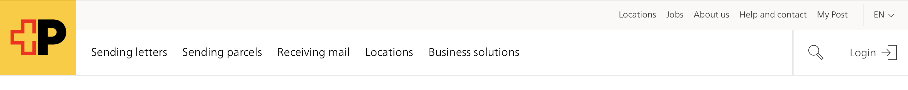
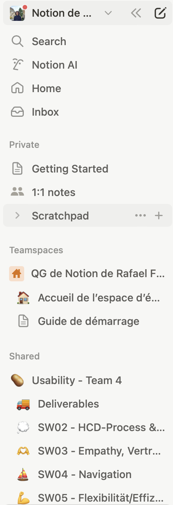
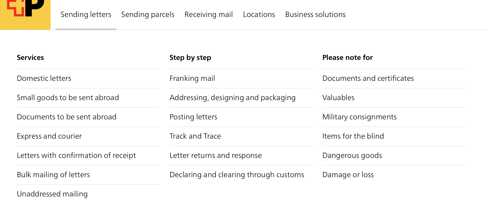
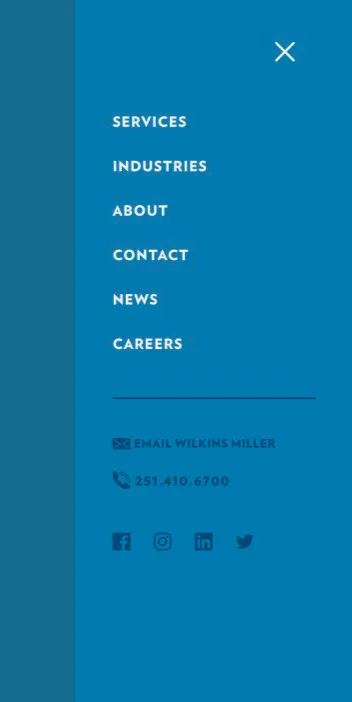
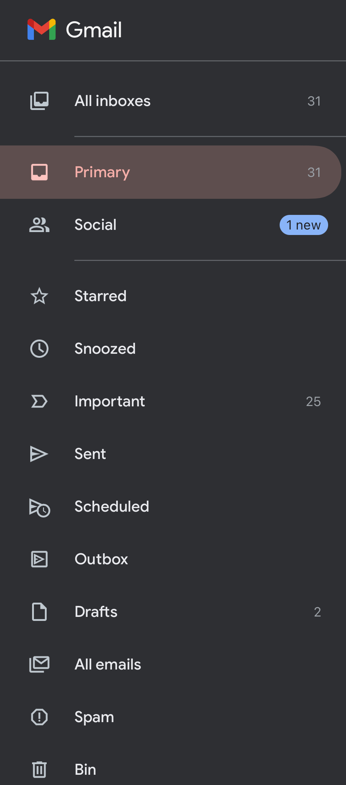
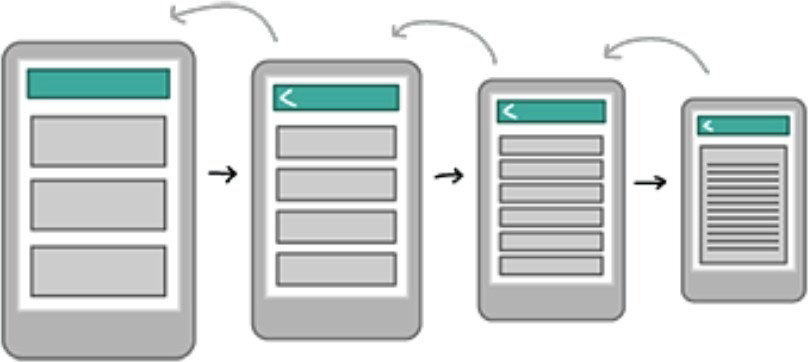
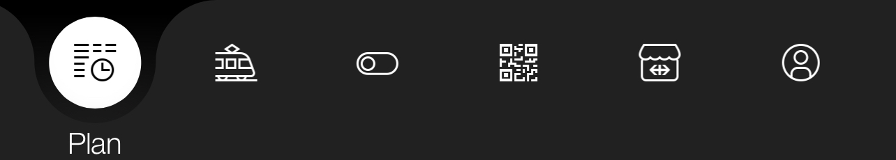

# Learn Facts

## Artefacts that we have created and delivered

We were split up into breakout rooms and worked on the Miro board to give feedback to the website [post.ch](http://post.ch) regarding its navigation based on the following four prompts:

“What are the five most typical reasons why users go to post.ch?”

“What other tasks can users fulfil on [post.ch](http://post.ch/)?”

“What do you like about the navigation of [post.ch](http://post.ch/)?”

“What do you dislike about the navigation of [post.ch](http://post.ch/) and why?”

At the end of the lesson we did a Kahoot quiz to test ourselves on what we had learned in the lesson.

## What have we learned?

We learned that navigation o a platform is key in order for users to have an easy and positive experience finding what they need to use. There are multiple aspects to be looked at and taken into consideration, such as context and the different navigation concepts.

### Context

When looking at creating navigations we have to find out what we need to know. The context refers to knowing the scenarios in which these navigations will be used which include user, tasks, situation, tools and terminal.

The user refers to knowing which users are going to be the ones using your platform, their interests, reasons for being there, and possibly their previous knowledge related to your platform’s topic or style.

Knowing the tasks means knowing what will need to be performed using the navigations. This  includes finding certain information on the website or inputting some information like dates, (email) addresses, locations, etc.

Situation refers to the surroundings of the person using the system. For example, are they in a busy are with a long queue behind them and therefore need something that will work as quickly and simply as possible? Are they in a quiet environment like at home working on a project where they could afford to spend some extra time on a more detailed dropdown menu that will in exchange provide them with more information?

The tools are what will be used in creating the system, this can include surveys for user scenario building, interviews and meetings to further the understanding of the users’ needs and wants, but also the programs and structures which will be used to create the system. Finally, terminals refer to the medium used to present the system, for example an app presented on a phone or a website presented on a laptop.

### Navigation Concepts

There are many navigation concepts that can be used and they all serve different functions and have their own advantages and disadvantages based on what navigation concept is needed for specific tasks.

**Website Navigation Concepts**

**Horizontal Navigation**

Image source: Screenshot from post.ch

Pros:

Cons:

- Best visibility

- Number of links is limited

- Takes up little space

- Dropdown menus usually cover the content
- Does not require big mouse movements to select a link if it has a dropdown

**Vertical navigation:**

Image source: Screenshot of this Notion’s side menu

Pros:

- High number of menu items possible
- Several navigation levels are possible
- Clear structure is easy to make

Cons:

- Takes up a lot of space
- May be invisible at first glance

**Dropdown Menu:**

Image source: Screenshot from post.ch

Pros:

Cons:

- Space for subpages

- Can become long and extensive

- Expandable

- Can become confusing
- Several layers & flyouts possible

**Off Canvas:**

Pros:

- Saves space on main page
- Offers room for extensions
- Works of mobile and PC
- Easy to structure

Cons:

- Invisible at first sight
- Always requires an action to be accessed (like clicking a button)

Image source: Screenshot from SW04 Navigation presentation

**Breadcrumbs:**

Pros:

- User always knows where they are and can skip back several steps with just a click
- Takes up little space
- Navigation is intuitive

**Mobile Navigation Concepts**

**Hamburger Menu:**

Image source: Screenshot from Gmail

Pros:

- Is intuitive
- Allows direct access to an element

Cons:

- Hides information
- Usually not within thumb range

**Nested Doll:**

Image source: Screenshot from SW04 Navigation presentation

Pros:

Cons:

- Provides simple, linear theme

- Not able to switch quickly between themes

**Tabbed View:**

Image source: Screenshot from SBB Mobile app

Pros:

Cons:

- Task-based apps with similar subject areas

- Best suited for simple structures
- Allows multitasking

## What was difficult?

A difficult aspect of the class was the activity where we had to critique the navigation on [post.ch](http://post.ch) as we did not have much information or experience and found it hard to pick out aspects to be judged.

## What was the highlight?

It was veyr nice to have a guest speaker. We learned a lot and the breakout rooms to do this activity offered a nice break from the standard lecture structure.

## What was the lowlight?

A lot of us had struggles with focus due to the class being online as opposed to face-to-face.

## What advice can you give other students on this topic? By quote, by picture, by video?

A piece of advice that will probably be given in any navigation introductory course is the following:

“Make the navigation as simple as possible. It must be easy to understand for those who do not use your system often.”

The point is to cater to people’s needs as quickly and easily as possible so you can ensure they have a good experience.

## Open questions we would like to ask?