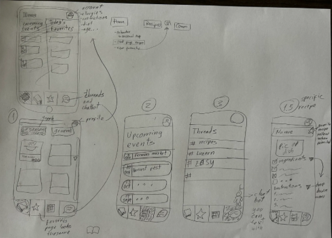

# HCD Process & Outbreak Project

## 1 Define the Product

- We want to create an app for mobile devices → Cooking app for students

## 2 Define the context of use

- User: A student (in a technical degree) with a good digital affinity, who wants to learn how to cook but has a strict schedule with not a lot of free time and needs to approach cooking in an efficient way.

- Goals: I don‘t want a complicated recipe, I want to cook with in season products (cheaper, sustainable and tastier), I want to save time when I cook.
- Tasks: Scroll, search for a recipe, gather ingredients, cook, favorite recipe (optional).
- Environment: kitchen.
- Resources: Ingredients, cooking utensils, a phone.
- Remark: The app is not supposed to be a competition or morality based app but instead it looks to be helpful and make it easier for the user to save time and money.

## 3 Define the Scope

### Use Cases

1. A student is about to go do their weekly grocery shopping and wants to check what would be cheaper to buy currently, they check what is in season at the moment and go buy that.
2. A student is about to cook something, they have a select amount of ingredients in their fridge and want a recipe that fits what they have and considers their allergies and food restrictions.
3. A student wants to communicate with other users and ask tips from people that live in their area/canton/country.

### Scenario

Annabella is a 21-year-old college student. She struggles to live on a tight budget while juggling school and a part-time job. Living with food allergies only adds to the challenge of grocery shopping and meal planning. Every week, Annabella wishes there was a better way to find affordable, seasonal ingredients without spending hours checking prices at different stores.

On top of that, cooking can be a headache. With a limited number of ingredients in her fridge, Annabella often feels stuck trying to figure out what to make. She dreams of a tool that would suggest recipes based on what she already has in her fridge, and also take into account her dietary restrictions.

It would also be a relief to connect with others in her area, especially fellow students or locals who might have advice on affordable grocery options or seasonal recipes in her area. Annabella envisions an app where she could ask these questions and get tips from people in the same area.

If only there were a solution that combined shopping planning, allergy-friendly recipes, and a community for sharing local advice, Annabella's life would be so much easier.

## 4 Ideation – find ideas

We skipped this one because we already have the idea

## 5 Prototype a first UI-Flow

## 6 Test the prototype

- Find a recipe and save it to your favourites
- See what the upcoming events are in your area
- Open a thread about a topic you are interested in