# ⛵️ Navigation

- [🏠 Home](index.md)
- [💡 Learn Facts](LearnFacts/Learn%20Facts%20SW04.md)

## Scenario

Annabella has a very busy university-work life and has very limited free time outside of that. She doesn’t have much experience with recipe apps and especially not with MealBestie. She is slightly nervous to try and use it because she doesn’t want to spend a lot of time trying to learn how it works and understand all its intricacies like she’s had to do with many other apps, whether they were cooking apps or for something entirely different.

She reluctantly opens the app to try and quickly find a recipe she can cook before her next online class and is surprised at how easy it is to use. The tabbed view at the bottom of the screen makes it very easy to navigate to an easily understandable recipe page where she quickly finds something simple that she likes. She is very happy with the ease of the task and vows to explore the app more and add some recipes to her favourites tab to cook later.

## Comparison to Other Apps

Navigation is a crucial part to any system, including apps. A good navigation concept that best fits the goal of the app makes for an easy user experience with no hassle that leaves a lasting positive impression.

- Calendars
    
    The app “Calendars” uses a hamburger menu navigation concept. It is the only way to navigate in the app as the tabbed view offers only a switch between months (Figure 5). It is a good implementation because this means that a menu that is very full of items is hidden from view.
    
    The hamburger menu utilises toggles to minimise the long list of calendars (Figure 1), offering a sleek look. However, the default state of the menu is to have all the group toggles open (Figure 2), which means that to access anything that can be seen at the bottom of Figure 1, such as Tips & Tricks - a tutorial on how to best use the app - and Settings requires a lot of scrolling. It is also not very intuitive, since these buttons are not highlighted in any way compared to the calendar menus.
    
    The Calendars app also uses the Settings space as a space to personalise everything, including the user’s profile, the app’s themes, calendar defaults such as alerts, and system defaults such as time zone and which type of calendar a user prefers as can be seen in Figure 3.
    
    The app has a switchable view, but the default and most practical is the monthly view that displays all events taking place as shown in Figure 4. It displays them chronologically for each day and is able to fit up to five events.
    
    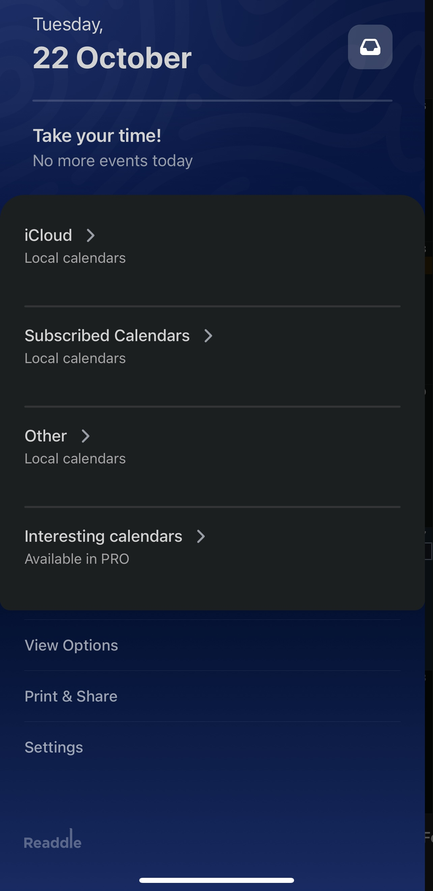
    
    Figure 1: Collapsed hamburger menu in Calendars app
    
    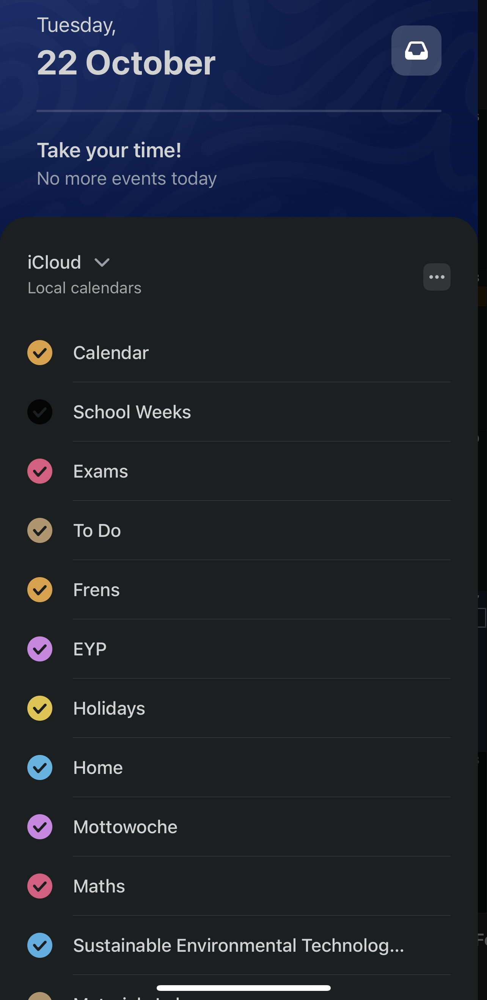
    
    Figure 2: Expanded hamburger menu in Calendars app
    
    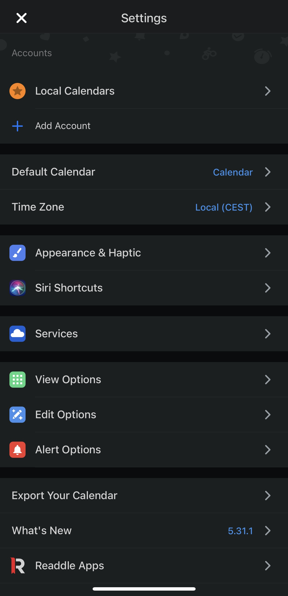
    
    Figure 3: Settings menu expanded in Calendar app
    
    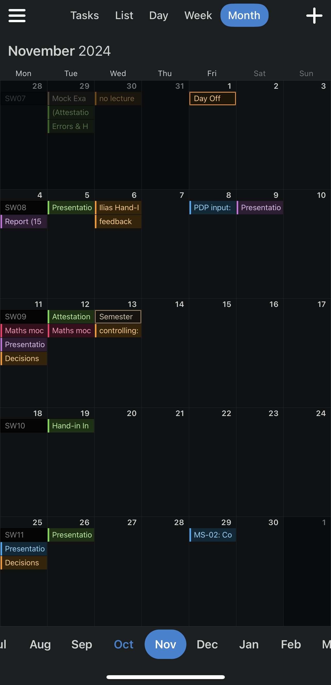
    
    Figure 4: Monthly view of Calendar app
    
    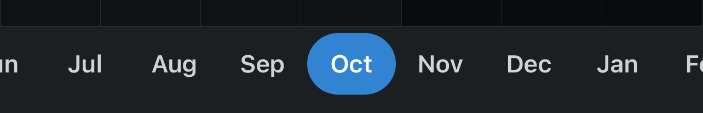
    
    Figure 5: Tabbed view of Calendar app, which offers only a scrolling system between months.
    
- SBB Mobile
    
    The SBB Mobile app uses a tabbed view at the bottom of the app. It offers access to all customisations in the app, with the expansions showing up when a tab at the bottom is clicked. This system works well for the SBB app as it allows it to have a clear, minimalistic structure throughout the app.
    
    The Plan tab is the first and default tab. It is very simple and quick to use to look up public transport connections using just a swipe across the screen (Figure 6). It gives the user a very fast process when they are in a rush to buy a ticket. The second Trip tab (Figure 7) displays the saved trips in chronological order so the user can easily keep up with connections and delays of their upcoming trips.
    
    However, the issue with having such a minimalistic upfront look is that any of the more full tabs are very hard to navigate from the first go and need to be learned. Figure 8 shows the tab Shops & Services, which, especially if you don’t know the Swiss transport system, gives a long list all at once about types of tickets that can be purchased with no further explanation of what they’re for unless the user clicks on them and then on the information button, which is a very long path.
    
    Similarly, the Profile tab looks very busy at a first glance and requires a thorough reading-through in order to understand where to press next to reach the correct setting change, unlike the Calendars app that has all the settings together in one place (Figure 9).
    
    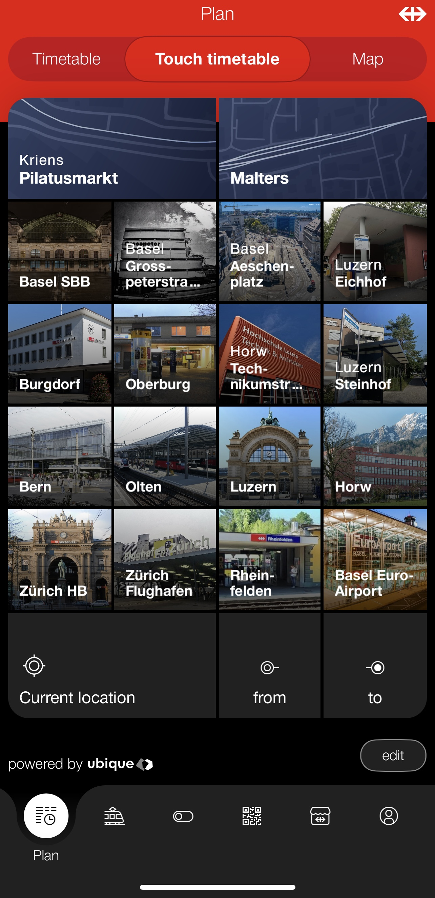
    
    Figure 6: Plan tab of the SBB Mobile app
    
    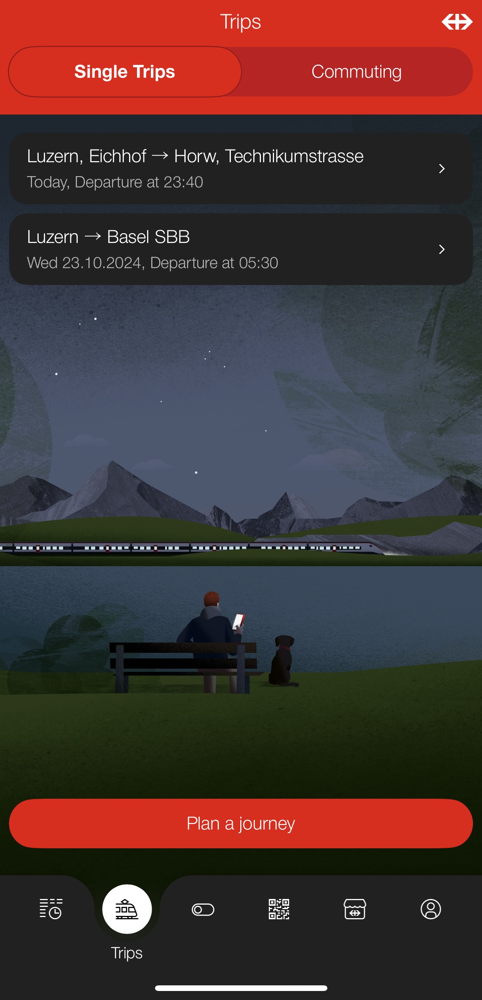
    
    Figure 7: Trips tab of the SBB Mobile app
    
    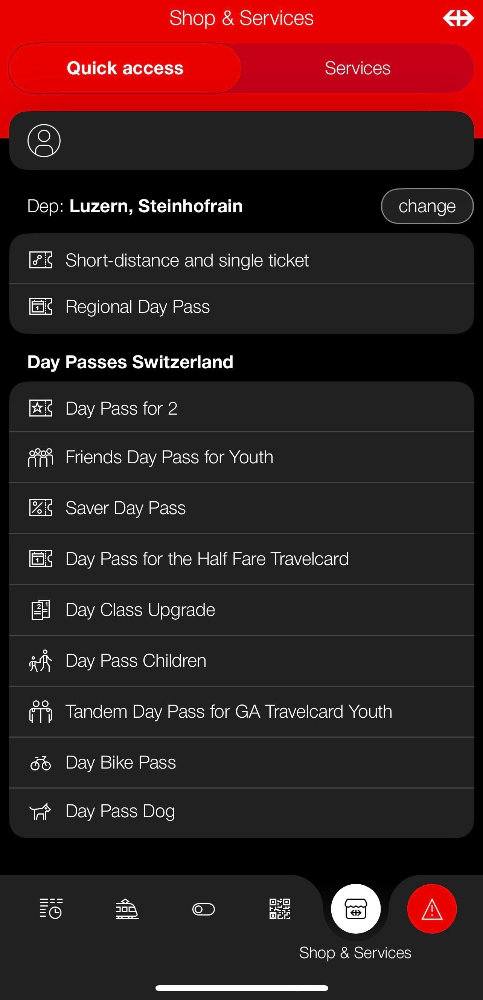
    
    Figure 8: Shops & Services tab of the SBB Mobile app
    
    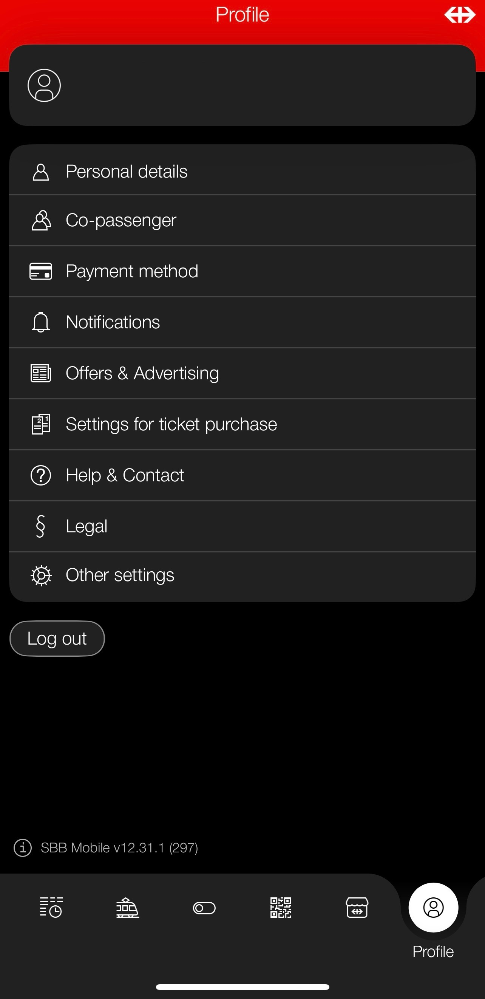
    
    Figure 9: Profile tab of the SBB Mobile app
    

| Scenario | Finding / Description | Garret-L / Severity | Proposal |
| --- | --- | --- | --- |
| Navigating the app spaces (Figure 2) | Annabella wants to find a quick recipe to cook but the hamburger menu is so extensive she doesn’t know where to start looking first. | Navigation
/
Crucial problem | Make a concise, minimalistic menu in the form of a tabbed view at the bottom of the app (Figure 6). |
| Finding profile customisation (Figure 1) | The extensive hamburger menu is a lot to scroll through. Annabella gets overwhelmed but eventually finds the “Settings”. She wonders where the “Profile” button is. | Navigation
/
Minor problem | Name the profile customisation “Profile” and make a clearly seen profile icon in the top right corner of the app (Figure 9). |
| Event view (Figure 4) | Annabella opens the “Events” tab. She is very curious and excited to look at it. She sees that it’s almost empty, with events barely happening once a month and is disappointed. | Navigation
/
Minor Problem | Make a list of the events happening in the future so there will not be a lot of blank space to take up the screen (Figure 7). |
| Event scrolling (Figure 4) | Annabella wants to look at future markets that will happen in the spring; she’s curious to know if there will be more events when it becomes warmer but she has to scroll through a lot of months to get to the late spring season. | Navigation
/
Serious Problem | Make a shortcut in the “Events” tab that will allow the user to skip months or years ahead. |

## Implementation into MealBestie

MealBestie does not have a big menu that needs to be collapsed in order to be navigated quickly, therefore the best implementation would be a tabbed view at the bottom of the screen that allows the user to quickly navigate to the place that they want to be in the app.

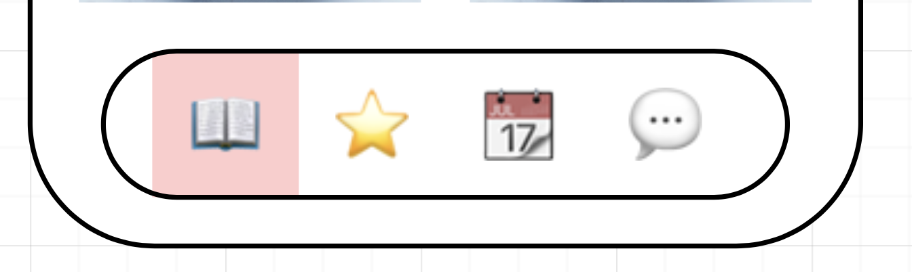

Figure 10: Tabbed view menu at the bottom of the MealBestie app for quick multitasking

Because not every day will have a farmer’s market event, it does not make sense to have a monthly view like in the Calendars app (Figure 4), but rather a view like in Figure 6, of the events, the dates they’re taking place on and the location. A dropdown arrow should be added beside the “Events” title to open a dropdown calendar to allow quick switching between far away months without a lot of scrolling.

Clicking on an event will open it out on the next screen which will provide more information such as the full address, the time, any updates regarding it, and a general overview of what will be sold. It will also have the option to favourite it, which will put it at the top of the list of events until the date of the event passes, when it will automatically be deleted.

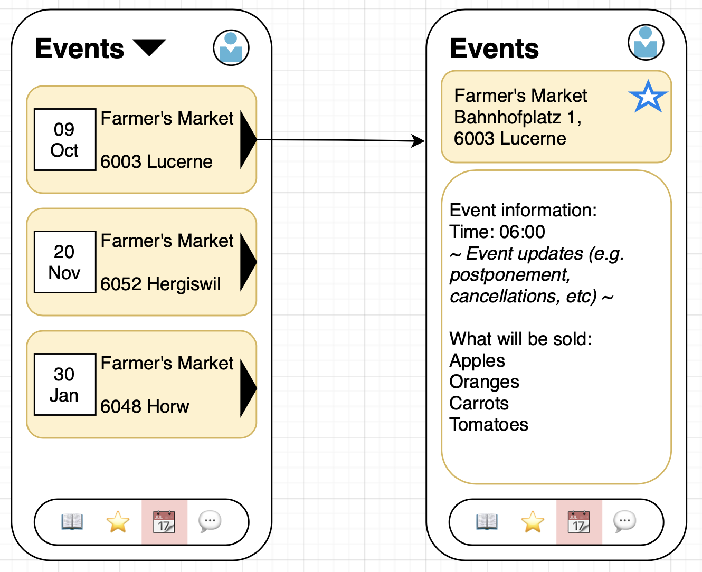

Figure 11: Events Calendar on MealBestie