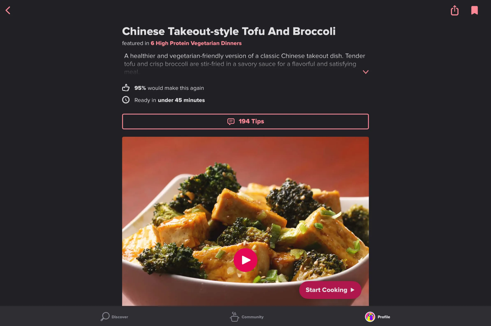

# 💪 Flexibility/Efficience & Feedback

- [🏠 Home](index.md)
- [💡 Learn Facts](LearnFacts/Learn%20Facts%20SW05.md)
- [✍️ Transfer Tasks ](TransferTasks/Transfer%20Tasks%20SW05.md)

## Scenario Persona

Annabella is a 21-year-old student balancing her studies and a part-time job. With limited time and only a few ingredients in her fridge, she opens the MealBestie App ****to quickly find a recipe that accommodates her food allergies. Almost immediately, she discovers a range of simple, allergy-friendly recipes based on what she already has on hand.

With just a few taps, she selects a recipe and starts cooking as efficiently as possible. The app guides her step-by-step, and offers her replacement recommendations to fit her food restrictions. Thanks to the app, Annabella is able to quickly prepare an easy meal without needing to run to the store or spend extra time searching for recipes.

## Comparing Other Apps

### Flexibility and Efficiency

Cooking apps must emphasize flexibility and efficiency to meet users‘ needs. Flexibility allows users to customize their cooking experience based on dietary preferences and available ingredients. Efficiency is equally as crucial for a seamless user experience. Apps should feature intuitive navigation, allowing users to quickly browse recipes and access essential information like ingredient lists and cooking instructions.

- CookPad
    - User preferences: After clicking on the settings tab on the menu of the CookPad, we come across a list of tabs. There is a lack of flexibility for the user when it comes to inputting their preferences. There is no option to include food restrictions,  preferred units of measurement, amongst others. Additionally the design is not very intuitive, the user may think that they can add their preferences in the account tab but it only includes subscription offers and the user’s friends. Nonetheless, the user is able to change the theme for the app (see figure 2 ) where they can decide if they would prefer to use the device settings, light or dark mode.
    
    
    
    Figure 1 : Settings screen - CookPad
    
    
    
    Figure 2 : Screen after clicking on theme tab - CookPad
    
- Tasty
    - Recipe selection: Tasty offers a high degree of flexibility when it comes to finding recipes in its massive library where users can filter by cuisine, dietary restrictions, difficulty level, allowing users to find recipes according to their specific needs.
    - Ingredient substitution: There is no flexibility when it comes to ingredient substitutions on specific recipes as you can see on figure 3 . Once you click on a recipe it shows you the reviews, list of ingredients, steps, etc, but there is no opportunity for the user to substitute the ingredients in the case of allergies.
        
        
        
        Figure 3 : Recipe screen - Tasty App
        
    - Lists and grocery shopping capabilities: For some recipes, Tasty allows users to create shopping lists in the app, with an option to sync them to grocery delivery services (Only in the United States).
    - Tasty also has an efficient core feature which is providing step-by-step visual instructions (See figure 4 & 5 below).
    
    
    
    Figure 4 : Recipe Screen - Tasty
    
    
    
    Figure 5 : Screen after clicking on “Start Cooking” button
    
    - Additionally, Tasty asks the user in a straightforward manner what their preference is and what is the purpose of them having the app right after they register inside the app. This allows for an efficient incorporation and catering to the user through the app.  (See figures 6 & 7).
    
    
    
    Figure 6 : Display of Tasty App Screen after registering on the app
    
    
    
    Figure 7 : Next step after registering on Tasty App, questions on the expectations of the user.
    

### Feedback

Apps can significantly enhance user experience by integrating comprehensive feedback mechanisms. Users should be able to leave ratings and reviews not only on recipes but also on the app‘s features and usability. Incorporating a real-time feedback feature enables users to report issues or suggest improvements directly within the app.

- CookPad
    
    CookPad offers a user-friendly feedback system accessible directly from the menu screen. Users can easily find the intuitive "Send feedback" tab, where they can write and submit their comments (See figures 8 & 9). The app also provides a mechanism for reporting other users' content. When viewing a user's post (recipe), there's an option to report inappropriate content. However, this action automatically blocks the reported user on your account, sending the report to the app simultaneously (See figure 10).
    
    
    
    Figure 8: CookPad Menu View
    
    
    
    Figure 9 : CookPad “Send Feedback” Screen
    
    
    
    Figure 10 : Screen when reporting & blocking a user - CookPad App
    
- Tasty
    
    Tasty allows users to leave feedback on recipes through ratings and reviews.
    
    For app-related feedback, Tasty offers a section in the settings with an "Email Tasty Support" button. However, this action only works if your device meets certain configuration requirements (see figure 11 below).
    
    This approach to feedback is problematic. Users are restricted and can't communicate directly through the app, potentially leading to frustration. A well-designed app would offer more feedback options or provide clear instructions to resolve any configuration issues.
    
    
    
    Figure 11 : Feedback screen displaying error - Tasty App
    

| Scenario-part | Finding / Description | Garret-L / Severity | Proposal  |
| --- | --- | --- | --- |
| Input your preferences in the settings of the app.
(See Figure 1 & 2) | Anabella goes to the menu on the CookPad app to find the settings of the app. She presses the settings button and sees a folder/button called Theme where she can adjust the theme of the app (Dark/Light mode), when she clicks on the “about the app“ folder/button she only sees the licenses and app information but no folder/button is found where she can input details about her preferences aside from the theme.  | User needs
/
Critical Problem

 | Anabella misses the ability to input her food restrictions, diet, allergies, metric system, amongst other relevant preferences (Flexibility).
 |
| Sending feedback through the app.
(See Figure 8 & 9) | Anabella wants to send feedback about the lack of flexibility regarding preferences on the CookPad app. She goes to the menu and sees a “Send feedback“ button.  | Interaction Design 
/
Good
 | Anabella likes that she didn‘t have to look for the feedback section for too long as it usually is inside the settings and then in the help & support section. (Efficiency) |
| Reporting a user on the app.
(See Figure 10) | Anabella was scrolling through recipes when she found a user on CookPad who copied her recipe and didn‘t give her credit, she wants to report the user so she presses the “…“ on the users recipe and proceeds to report and block the user. This „ report and block“ occurs simultaneously so she can’t report without blocking. | Interface Design
/
Minor Problem
 | Anabella wishes she could just report the user/ recipe instead of reporting and blocking simultaneously, she would like to be able to follow up on the corrective action from CookPad but the design doesn‘t offer her the flexibility. (Flexibility) |
| Replacing an ingredient in a recipe (See figure 3) | Annabella finds a recipe that catches her eye. She clicks on it and is immediately dissapointed when she sees in the ingredient list an ingredient she is allergic to and no replacements are available on the display.  | Functional Specifications
/
Serious Problem | Annabella wishes she could replace that ingredient for something else instead of having to look for a new recipe. |

## Implementation of Ideas in The App

### Flexibility and Efficiency in MealBestie

- User Preferences: The user can make changes on their preferences  through the user preferences tab in the profile menu/screen. This user preferences tab allows the user to input/edit their food restrictions, allergies, preffered measurement units, and language.  Allowing for ultimate flexibility and an efficient catering of the users’ needs.

- Ingredient Substitution: Recipes should be catered to the users according to their food restrictions and inside their users preferences. Nonetheless, if the user forgot about something and came across an ingredient they disliked in a recipe, there will be a “…” next to the ingredients on the list which will let the user know if they can exclude the ingredient for the recipe or if the ingredient cannot be excluded then it will offer replacement recommendations.

### Feedback in MealBestie

- Ingredient Substitution Complaint/Feedback : After the user skims through the ingredient substitution and sees that the system did not provide successful recommendations they can report this directly on the recipe screen.

- App Feedback: After a successful cooking session, Annabelle wants to provide her feedback on the efficiency of the app so she goes to the profile menu/screen and taps the “Send us Feedback” tab to write her thoughts and recommendations for improvement, after pressing send, her screen displays a message pop up message, letting her know that her feedback was received.

