# 🚨 Errors & Errors-Mgmt

[💡 Learn Facts](LearnFacts/Learn%20Facts%20SW06.md)

## Scenario Persona

Annabella, a 21-year-old juggling school and a part-time job, relies heavily on her app to help her tackle daily tasks efficiently. Thanks to smart error-handling features, she navigates her options with ease, avoiding slip-ups and staying on track.

With preventive guidance, Annabella gets little tips that help her steer clear of common mistakes before they happen, so she can move through tasks without second-guessing. And if she does click the wrong thing, quick correction options make it easy for her to fix it instantly and get back on track without the frustration of redoing things.

For the more crucial steps, confirmation prompts give her a moment to double-check, providing peace of mind and guiding her through confidently. Altogether, these thoughtful features save her precious time, minimize headaches, and help her keep her busy day moving smoothly.

## Comparing Other Apps

### **Slip prevention**

Apps and websites should make it easy for the user to understand what’s important and what’s not. When a user understands that this button might modify/delete his data for instance, he will be more careful and focused.

- Github
    
    Github makes it difficult for the user to accidentally change a critical parameter of one’s repository. In order to be able to change its visibility, disable branch protection rules, transfer it, archive it or delete it (more on that one later), the user is forced to go to the last options on the menu, “Settings”, and then scroll to the very bottom of the page, where a big red “Danger Zone” section clearly emphasizes the importance of all those functions.
    
    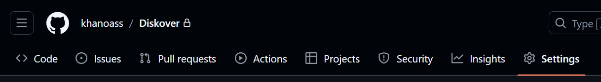
    
    Fig. 1: Github settings page
    
    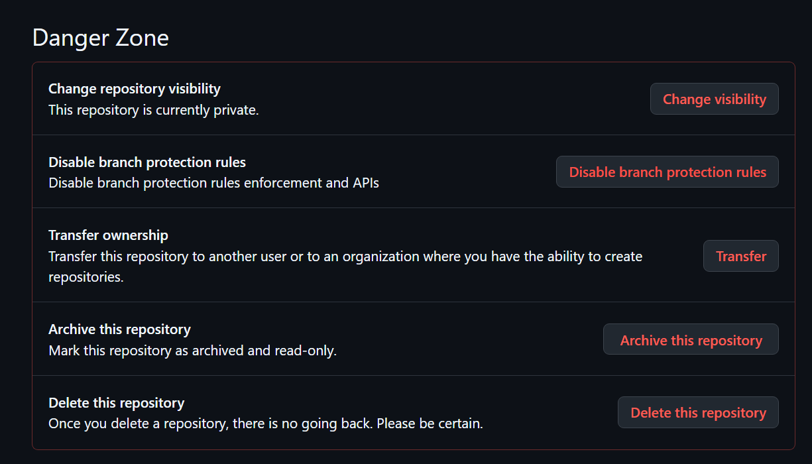
    
    Fig. 2: Github danger zone
    
- Google Drive
    
    On Google Drive, if a user accidentally deletes a file or folder, it isn’t permanently removed but instead moved to the trash. If a user wants to delete it from the trash/completely, Google Drive displays a confirmation dialog box. This extra steps help prevent accidental deletions from mis-clicks or inattention, reducing the chance of unintentional errors.
    
    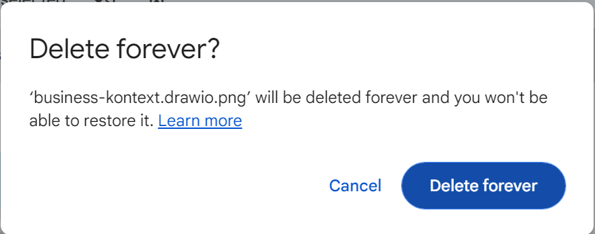
    
    Fig. 3: Google Drive delete forever
    

### **Slip correction**

- Github
    
    Github’s “Undo” feature is a thoughtful touch that helps users quickly recover from unintended actions. When a branch is deleted or an issue is closed, a handy “Undo” button pops up for a few seconds, offering an easy, immediate way to reverse the action. This is especially useful for those accidental clicks or moments of inattention, making it a simple safeguard against slips. By doing this, Github enhances both user experience and confidence, making the platform more forgiving and user-friendly.
    
    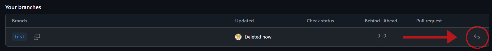
    
    Fig. 4: Github “Undo” action
    
- Google Drive
    
    A file/folder which has been deleted, or moved to the trash, remains there for 30 days, during which users can restore them with a single click. This mechanism helps users quickly recover from accidental deletions, correcting slips with minimal impact. As an added bonus, when deleting the file or folder, an “Undo” button pops up on the bottom-left corner. 
    
    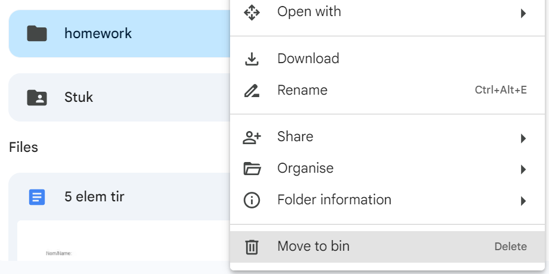
    
    Fig. 5: Google Drive “Move to bin” button
    
    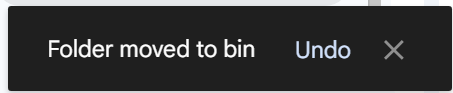
    
    Fig. 6: Google Drive “Undo” pop-up
    

### **Mistake prevention**

- Github
    
    Github is once again a very good example of good mistake prevention design. When a user wants to delete a repository, Github does not show one, nor two, but THREE pop-ups to make sure that the user understand the whole effect and scope of the deletion.
    
    First, it shows a pretty normal-looking pop-up.  
    
    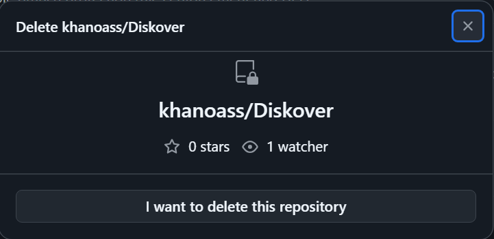
    
    Fig. 7: Github Delete repo step 1
    
    Then, when clicking on the button, a second pop-up comes up with more information about what’s going to happen.
    
    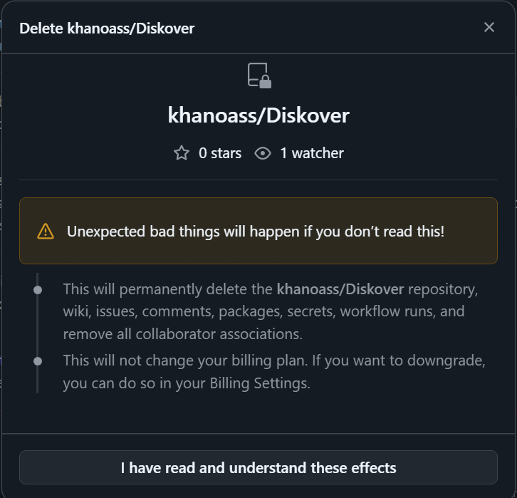
    
    Fig. 8: Github Delete repo step 2
    
    Then, a third one shows up, where the user has to complete a task, which is to type the username slash repository name, before being able to proceed, clicking on the final, red delete button, action which cannot be undone.
    
    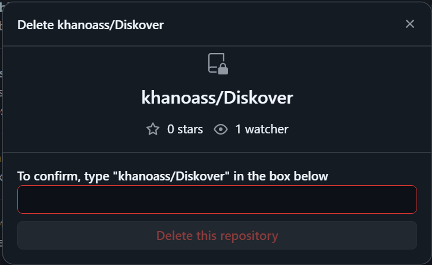
    
    Fig. 9: Github Delete repo step 3
    
    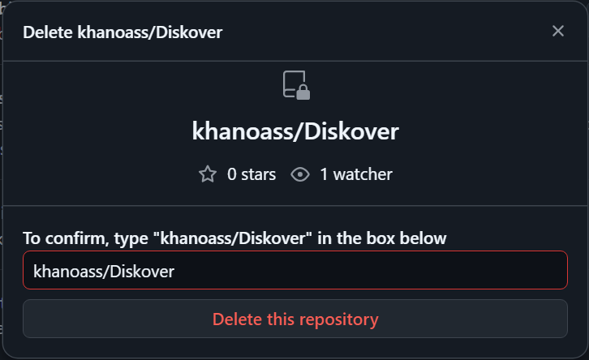
    
    Fig. 10: Github Delete repo end
    
- Google Drive
    
    Google Drive allows users to set specific sharing permissions (View, Comment, Edit) when sharing files. This prevents users from mistakenly granting inappropriate access levels, which could lead to unwanted edits or data exposure. By making users choose specific permissions, Google Drive aligns with the user's intention, preventing mistakes based on misinterpretations or misunderstandings about access.
    
    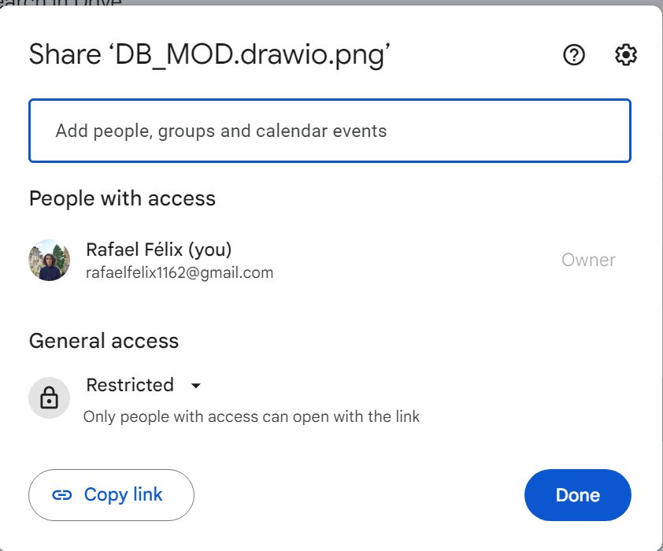
    
    Fig. 11: Google Drive share preferences
    

| Scenario | Finding / Description | Garret-L / Severity | Proposal |
| --- | --- | --- | --- |
| Deleting an account (fig. 1 & 2) | Annabella slipped up and deleted her account because the button was gray, and located on the homepage, and as such didn’t clearly state the severe consequences of the click. | Interface design / serious problem | Locating the “Delete Account” button at the bottom of the preferences page. (Slip prevention) |
| Deleting important saved data. (fig. 4 & 6) | Annabella saved some recipes in her favourites, but mistakenly slipped up and unfavourited one of them, and she sadly can’t find it again. | Interaction design / minor problem | Adding an “Undo” pop-up when a user unfavourites a recipe. (Slip correction) |
| Deleting an account. (fig. 7-10) | Annabella deleted her account by mistake, clicking on the “Delete Account” button in the preferences page.  | Interaction design / serious problem | Adding a confirmation dialog-box where you have to type in your username in order to delete your account. (Mistake prevention) |

## Implementation of Ideas in MealBestie

### **Slip prevention**

In order to minimize accidental account deletions, MealBestie has thoughtfully located the “Delete Account” button to a more discreet position at the bottom of the preferences page. By placing this button in a less accessible area and away from high-traffic locations, users are made more aware of the action’s significance, reducing unintended clicks.

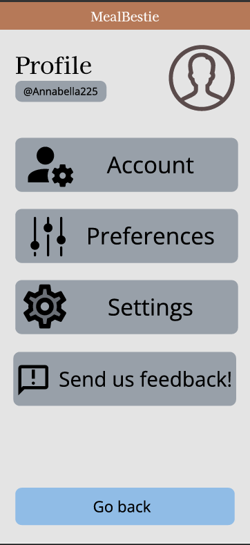

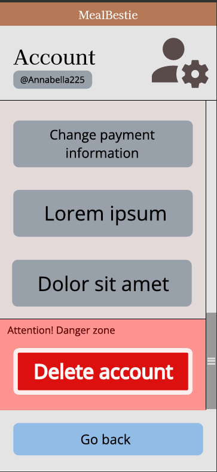

### **Slip correction**

To help users avoid accidental removal of saved items, the MealBestie introduces an “Undo” pop-up whenever a user unfavorites an item. This feature gives users a quick, convenient way to reverse the action, ensuring that they can easily correct slips without losing important saved content.

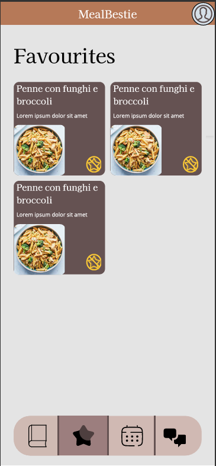

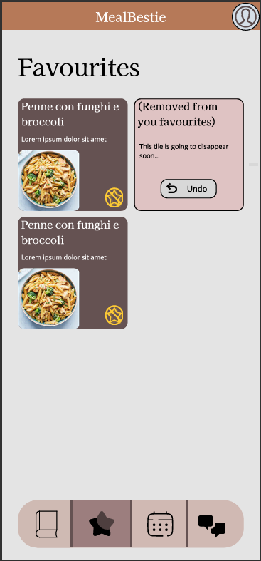

### **Mistake prevention**

For added security, MealBestie now includes an extra confirmation step for account deletion. Users must enter their username to verify the action, providing a final check that guards against accidental deletions and ensures users are certain of their choice.

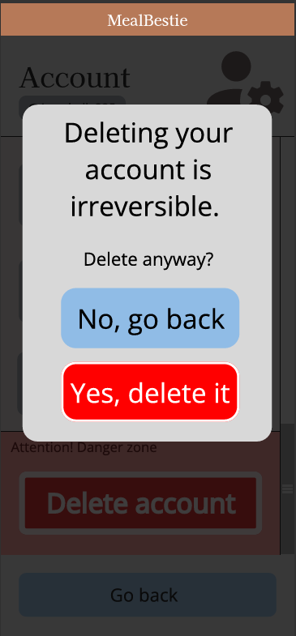

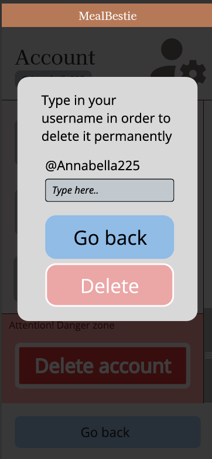

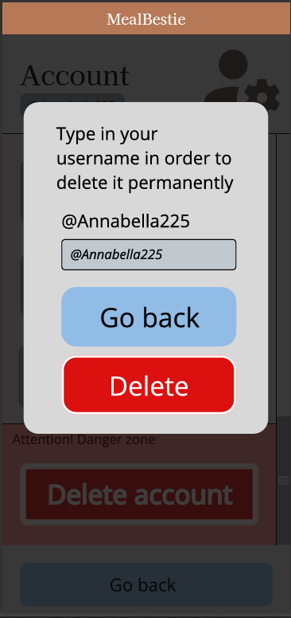