# 🔎 Visual Clarity

- 🏠 Home](index.md)
- [💡 Learn Facts](LearnFacts/Learn%20Facts%20SW07.md)

## Scenario Persona

Annabella is a busy student who balances her studies with a part-time job. She relies on the MealBestie app for quick, convenient meal suggestions that fit her lifestyle and dietary needs. Annabella is colorblind and wears glasses, so she appreciates interfaces that are designed with clear, accessible visuals that make everything easy to read and distinguish.

Annabella prefers a simple layout in the MealBestie app that allows for easy navigation. She values high-contrast colors that make text and buttons stand out, ensuring they are visible despite her colorblindness. Adjustable font sizes are important to her for better readability. Annabella preffers also dark mode because its more confortable for here eyes, but when she is outside, she somethimes uses also light mode. Therefore the theme of the app should do what ever the device does. She appreciates well-designed icons that are intuitive and easy to recognise. A consistent layout throughout the app also helps her feel comfortable and efficient while using the app.

## Comparing other apps

### Simplicity

For good visual clarity, an app should have a simple, uncluttered layout. This means avoiding unnecessary elements or too much information on a single screen. This allows users to focus on key tasks. Consistency within the app is also critical, ensuring that buttons, fonts, colours, and navigation are consistent across screens. A consistent layout helps users become familiar with the interface quickly, improving usability and reducing cognitive load.

- CookPad
    - Simple Layout: The Layout in the app CookPad is held very simple. Everything seems intuitive and easy to use. The app is also very minimalistic and not cluttered with too much functions. One bad thing is, that there is no separate page for the cooking instruction. Everything is in the page shown in the image bellow and gets visible when you scroll down.
        
        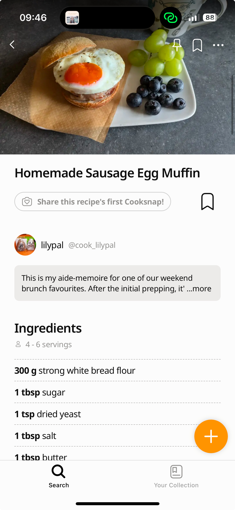

        
        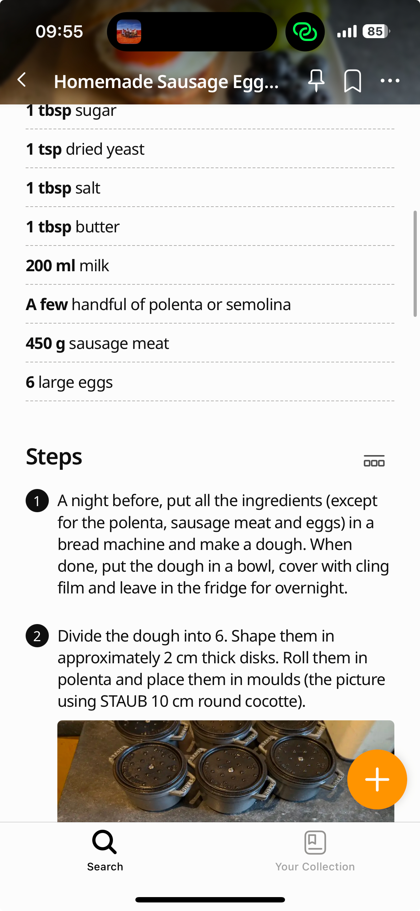

        
    - Consistent Layout: The app seems consistent through all pages, which is not hard to do in this layout because the layout is held very simple.
- Tasty
    - Simple Layout: The layout of the Tasty is not as simple as CookPad, but there are also a lot more functionalities. Everything feels intuitive to use and everything feels on the right place. However, the app is also a little bit cluttered with advertisements for premium subscription. Annabella likes the section with the recipes more because she has also a step by step mode.
        
        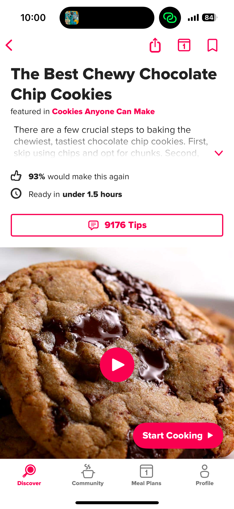

        
        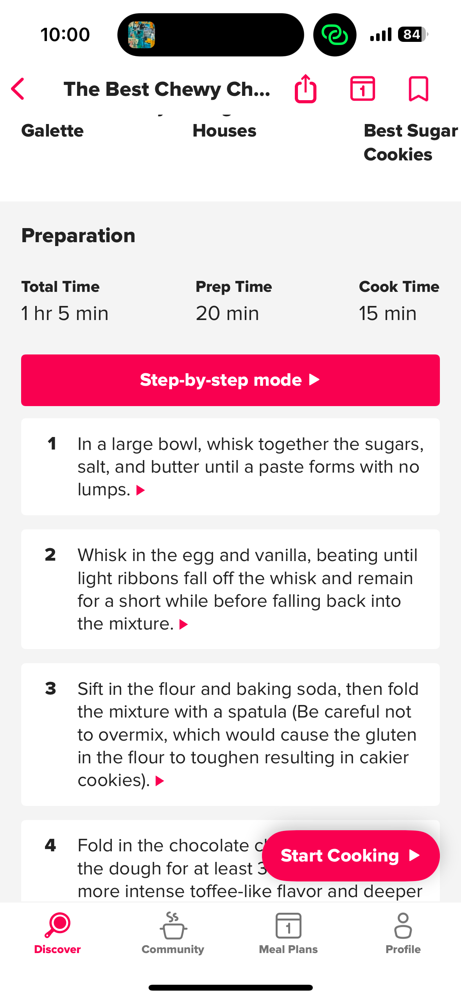

        
        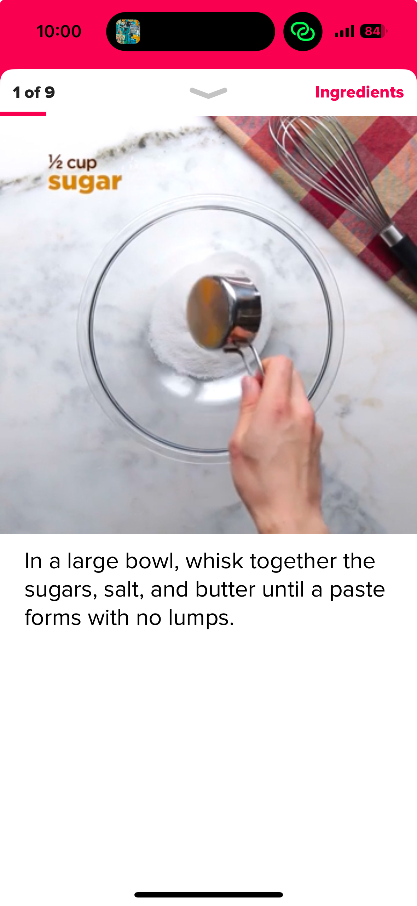

        
    - Consistent Layout: The layout through the app is not so consistent. On the first screenshot, you see recipes with round corners and two next to each other. In the community section, the layout is more built like a social media feed. But both are just for finding recipes, so it would be better to merge both pages into one.
        
        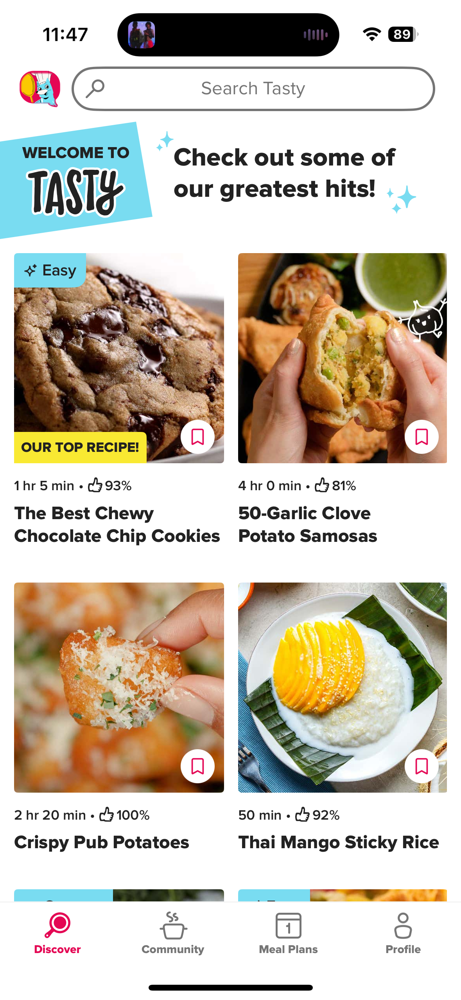

        
        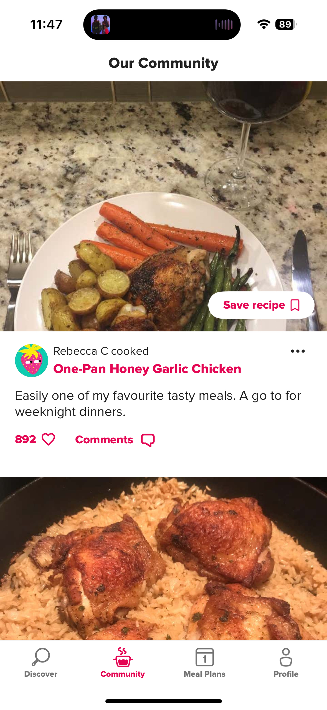

        

### Visual Accessibility

A good app should have well designed icons in it. They should be clear, intuitive, and consistent throughout the application and everyone easily understands their meaning. Also contrasting colors are essential for improving visibility and accessibility in an app. This makes it easier for users to distinguish between different elements, especially for those with visual impairments. Using high contrast between text and background colors ensures that content is readable in different lighting conditions. Furthermore, the font size should match the font size of the device settings.

- CookPad
    - Icons: CookPad does not have a lot of icons, but the ones the application uses are clear. However, the "Your Collection" icon could be a lot simpler than it is. But all in all it is okay.
        
        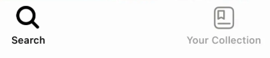

        
    - Contrasty colours, adjustable font size and dark theme: Contrast and color are almost okay. While it looks nice, the icons on an image are sometimes hard to see depending on the recipe. As a result, Annabella doesn't always know where to press to save an image. The app supports dark theme and when the font size of the phone changes, the app changes it too.
        
        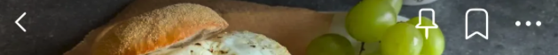

        
- Tasty
    - Icons: Like in Cookpad, the icons in Tasty are held very simple. It is clear what every icon does and they also change, when an icon ist selected. For example the magnifier lens is filled out and the cooking pod has something in it.
        
        

        
        

        
    - Contrasty colours, adjustable font size and dark theme: The constrast of the colour are almost okay. Sometimes the app uses a very light grey to show stuff, which is for Annabella sometimes hard to see. Like CookPad, the app supports dark theme and when the font size of the phone changes, the app changes it too.
        
        

        
        

        

| Scenario-part | Finding / Description | Garret-L / Severity | Proposal  |
| --- | --- | --- | --- |
| Simple Layout | Annabella wants a simple layout for a easy usage and navigation. On Cookpad, there is no separate and extra page for cooking the recipe. The app tasty is a little bit cluttered with functions or advertisements she doesn’t need. |  | Annabella whishes, she had a cooking app with a simple layout which is not clustered with stuff she doesn’t want. She also wishes a separate screen for cooking the recipes. |
| Consistent Layout | Annabella wants that the layout is consistent through the whole app, which makes the usage much more simple. The layout in CookPad does that indeed. On tasty, its not so consistent and she sometimes feels lost. |  | Annabella wishes she hat a consistent layout through the app, where she doesn’t feel overwhelmed. |
| Icons | Annabella wants simple icons, that she can navigate faster within the app. CookPad does this, but some icons just have to much details. Tasty does it very good. |  | Annabella wishes that the cooking app of her choice uses simple icons, where she can do what she wants to do much more simple because she doesn’t want to read the text. |
| Contrasty colours, adjustable font size and dark theme | Because Annabella wears glasses and is colourblind, she wants a cooking app which has good contrasts. Both apps have mostly good contrasts but also have flaws. Annabella also changes the Font size on her smartphone sometimes and prefers dark theme. |  | Annabella wishes, she had an cooking app with good contrast, where she sees everything at a glance. She also wishes that the app adapts her settings of the font size and the theme of the smartphone. |

## Implementation of ideas in the App

### Simplicity

- Simple Layout: MealBestie has a simple layout through the whole app. The app doen’t feel cluttered with advertisements, unnecessery pop ups and or unused functions. The app also has a separate screen for cooking instructions, which makes cooking so much easier.

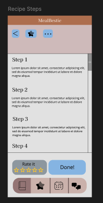

- Consistent Layout: The layout of MealBestie is simple and consistent through the whole app. For example, the layout, the colours and Fonts are same in the event section and where her favourite recipes are saved. Annabella can navigate very easily and doesn’t feel lost in the app because everything is consistent and familiar.

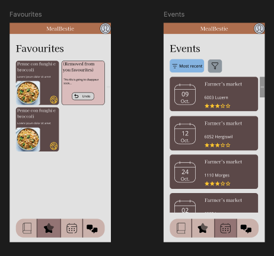

### Visual Accessibility

- Icons: The icons in MealBesties are simple and consistent through the whole app. When Annabella clicks one icon, the app does what she expects. Icons are used in several spots within the app.

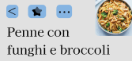

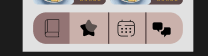

- Contrasty colours, adjustable font size and dark theme: The contrast of the app has been improved by the developers of MealBestie. In the first picture, the prototype had a dark gray background and black text. Annabella could barely see it. Now the creators of the app changed it to a lighter gray and black font. They also added icons to make it easier to see.

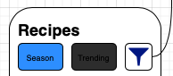

Contrast before

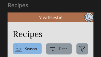

Contrast after