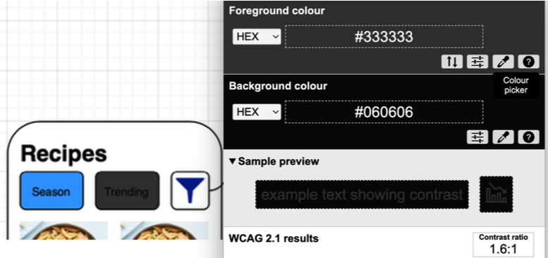

# 🦽 Accessibility

- [🏠 Home](index.md)
- [💡 Learn Facts](LearnFacts/Learn%20Facts%20SW09.md)

## Scenario Persona
Annabella decides to finally give a recipe a try; she has enough time today to spend a few extra minutes getting the hang of the app. She opens one of the recipes she saved to her favourites and starts prepping the ingredients. Once she’s done she clicks on the “Cook It!” and is pleasantly surprised when she gets a pop up window explaining how she can navigate the app with her voice. She accepts the request to access her microphone and starts following the steps.

About halfway through the recipe she gets her hands dirty in some of the oil and can’t touch her phone anymore without washing her hands. She decides to try out this feature. She says “Next Step” and watches as the app scrolls down to the next step. She leans over to read it and subconsciously appreciates the easy readability and strong colour contrast to be found throughout the app.

## Comparison to Other Apps
Accessibility is a vital feature of systems to ensure a smooth user context for any possible user, whether they have a disability or end up in situations that require such components. An exmaple is good contrast in colours, for people with impaired vision but also for people who are out in the sunlight and struggle to see their phones but can’t find some shade to hide under.

### McDonald’s
Some of the pages on the McDonald’s app follow the colour scheme to a fault, whether that facilitates a positive contribution or not. Figure 1, for example, has white tect over white stairs and a yellow button over an orange background, but when analysed with a colour contrast analyser, they both pass, the first with a ratio of 5:8:1 and the second with a ratio of 4:7:1.

*Figure 1: McDonald's Information Page*

Figure 2 exhibits the exact same phenomenon but to a detrimental level. The contrast of the white text on the yellow background gives a contrasting ratio of only 1:7:1.

*Figure 2: McDonald's Offers Page*

Figure 3 is an example of a very good accessibility feature seen in many other apps as well, such as the SBB Mobile app. It is not possible to be seen through the given screenshot but whenever the QR Code page is accessed in the McDonald’s app so the account can be scanned so the points can be reimbursed, the phone brightness increases to the maximum, making it easier to scan.

*Figure 3: McDonald's Account Qr Code*

### Burger King

In Figure 4, Burger King has much of the same problem as Figure 1, where the text seems barely readable because of the orange on brown colour palleCe but it s>ll passes the colour contrast test at a ra>o of 4:9:1.

*Figure 4: Burger King Point Counter*
 
Figure 5, the account QR Code once again has the same accessibility feature of increasing the screen brightness to the maximum when chosen.

*Figure 5: Burger King Account QR Code*

## Tables with the scenario and proposal

| Scenario | Finding / Description | Garret-L / Severity | Proposal  |
| --- | --- | --- | --- |
| Readability from far away (Figure 1) | Annabella can’t always move to stand right above her phone while she’s moving around and cooking in the kitchen but she hates that she can’t read the steps from afar because of a low colour contrast and small size. | Accessibility / Crucial problem | Increase colour contrast in the steps to make sure the text is distinguishable from the background and make it a couple sizes bigger too (Figure 7). |
| Inability to operate the phone while cooking | Annabella wants to scroll to read the next step of the recipe but she just got her hands covered in oil and can’t touch her phone. She doesn’t want to wash her hands every time she has to touch it. | Accessibility / Minor problem | Since this is her first time using the app for a recipe, when she opens the steps a pop-up window will inform her that she can use voice commands to navigate the steps (Figure …). |

## Implementation
To implement everything learned about accessibility the colour contrast analyser was used on our own app and adjustments were made where needed.

*Figure 6: Colour Contrast First Rendition*

*Figure 7: Colour Contrast Final Prototype*

To increase accessibility both to people with dirty hands and to people with vision and motor skills impariments, a voice-activated feature will be made available in the steps to ensure easy navigation of the page.

*Figure 8: Voice Activated Interration Page*

Lastly, although this cannot be visually shown with the current prototype, it will be vital that in the back end the proper hierarchy is implemented in headings, sub-headings and text.