# 🕦 Consistency

- [🏠 Home](index.md)
- [💡 Learn Facts](LearnFacts/Learn%20Facts%20SW10.md)
- [✍️ Transfer Tasks](<TransferTasks/Transfer Tasks SW10.md>)

## Scenario Persona

Annabella, a student balancing her studies and a part-time job, gets home late and needs to cook a quick meal with what she has at home. She opens the “MealBestie” App and presses on the menu bar the home page icon to find a recipe. She seems something she likes and clicks on it to start preparing, after she is done cooking and eating, she thinks of how much she liked the recipe so she opens the app again to “star” the recipe so she can make it again in the future. Thanks to the consistency of the app with the conventions in other cooking apps, Annabella doesn’t need to have a cognitive load to use the app and spend extra time learning what everything means.

## Comparing Other Apps

### Functional consistency (Internal consistency)

Functional consistency in cooking apps (and any app, really) is essential to providing a positive user experience. Functional consistency ensures that users can predict how the app works after just a short time using it. For example, if the “add to favorites” button is in the same place across recipes, users don’t have to search for it repeatedly. When users don’t need to re-learn or hunt for features every time, they can complete tasks faster. In cooking apps this is critical because users might be multitasking (e.g., cooking while referencing the app).

#### Tasty

At the top of the screen once we have clicked on a recipe we can see the share button (which falls into external consistency as it is used widely) and besides this icon we see the bookmark which intuitively means to save something, the user already knows that by pressing the bookmark he is saving the recipe(based on context and experience). It is always at the top of the recipe. (See Figure 1)

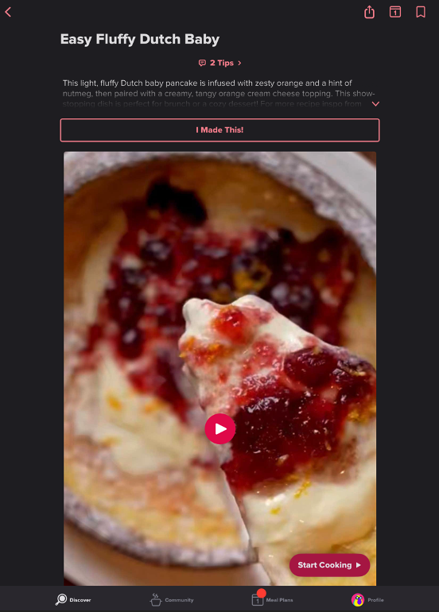

*Figure 1 : Tasty Bookmark function*

#### CookPad

On this app they maintain the bottom navigation bar throughout its interface (See Figure 2). Whether users are browsing recipes or looking at their saved recipes. This consistent placement and design allows users to seamlessly move between sections without re-orienting themselves. 

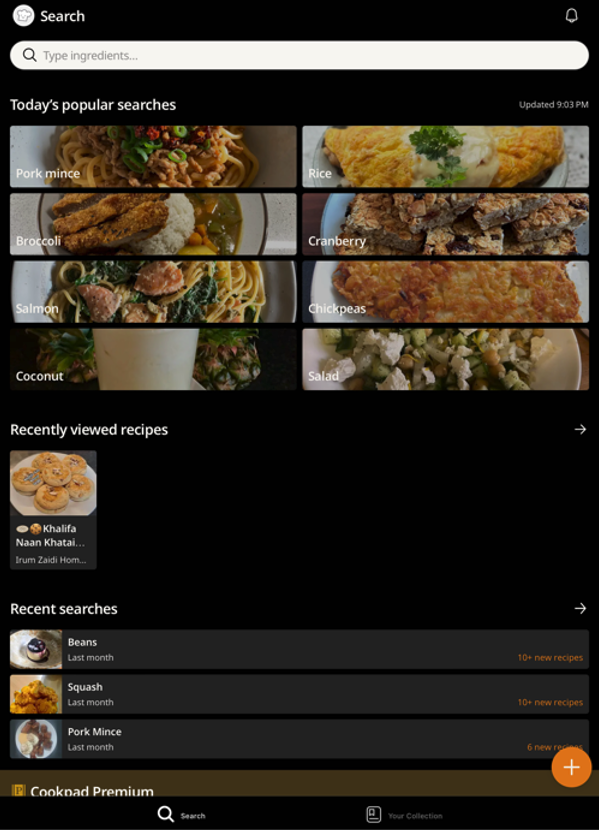

*Figure 2 : CookPad Homepage*

### Visual consistency (Internal consistency)

Visual consistency ensures that the app looks cohesive and intuitive, creating a seamless experience for users. A consistent visual design helps users quickly recognize and navigate elements like buttons, icons, and menus without confusion. A consistent layout and color scheme can also make the app more accessible to users with visual or cognitive impairments, ensuring a wider audience can use it effectively.

#### Tasty

The Tasty app uses a bold and vibrant color palette throughout its interface. Blue is the primary brand color, appearing in headers, buttons and highlighted text. Complementary colors (like red and yellow) are used sparingly for emphasis, such as “Start Cooking” or error messages. This consistent use of color reinforces the app’s identity, making it instantly recognizable and helping users quickly identify key elements. Additionally, recipes are presented in cards with a standardized layout: the recipe title in bold text, a high-quality image of the recipe, followed by the ingredients and the preparation procedure.  (See Figure 3 & 4)

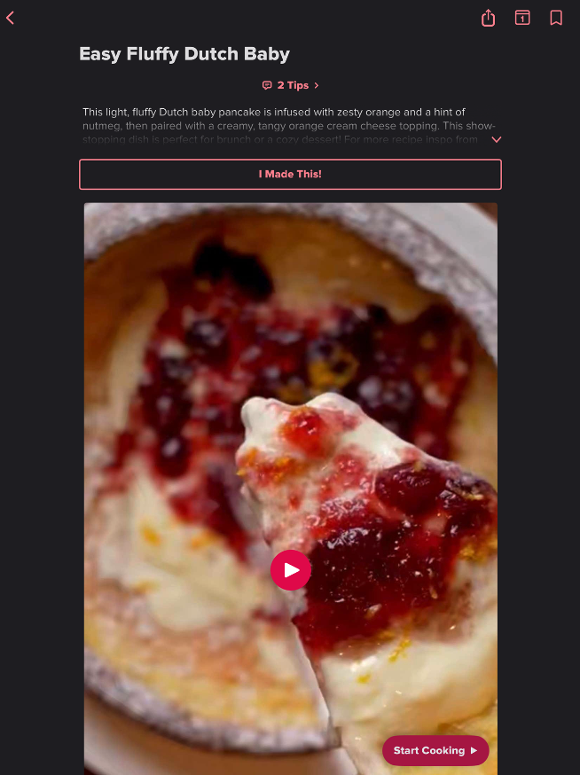

*Figure 3 : Tasty recipe screen*

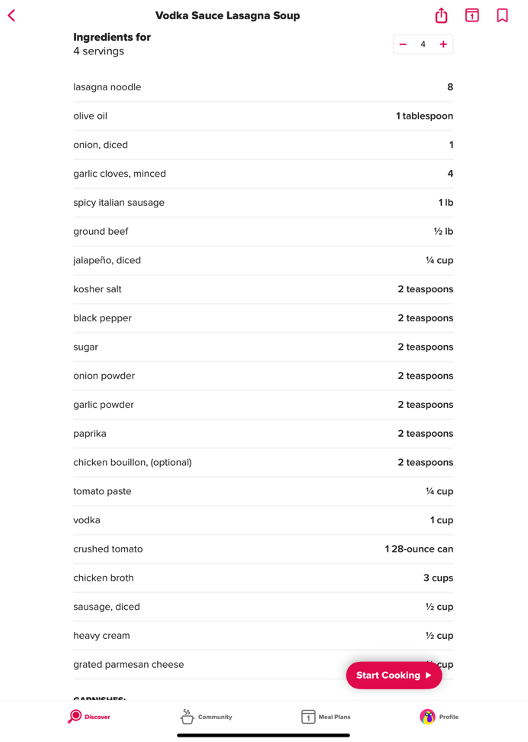

*Figure 4 : Tasty recipe screen 2*

#### CookPad

The CookPad app has a similar but more basic color palette. The primary color is yellow, and the complementary color is orange for highlighted text and the adding button (See figure 5).

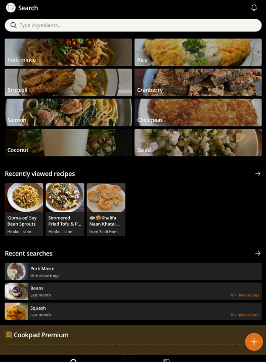

*Figure 5 : CookPad color scheme*

### Content consistency (Internal consistency)

Content consistency Is another critical aspect of usability in cooking apps. It ensures that the information and language presented throughout the app are uniform. Uniform language and tone make it easier for users to understand the app. Whether they’re reading recipe instructions or feature descriptions, consistent phrasing reduces confusion. Additionally, a consistent voice and style across the app reinforces the app’s personality and brand identity, making it memorable and recognizable.

#### Tasty

The Tasty app maintains a friendly, conversational tone throughout its content (See Figure 6), whether it’s in recipe descriptions or notifications. A consistent tone ensures that the app feels approachable and aligns with the casual, fun brand image that Tasty promotes.

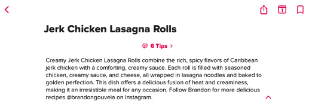

*Figure 6 : Tasty Recipe Description*

### External consistency

External consistency refers to ensuring that the app’s design, functionality, and content align with other similar systems or platforms that users are familiar with. It helps users transfer knowledge from one system to another, reducing the learning curve.

#### Tasty

On the Tasty app, users can swipe, tap, or scroll as they would in other apps, and navigation follows familiar patterns (tapping on a bookmark icon to save recipes, consistent with other apps like Instagram). There is also an integration with Real-World Conventions such as using cooking terms like “dice”, “sauté”, and “whisk” are familiar and universally understood by users. The same goes for the app CookPad.

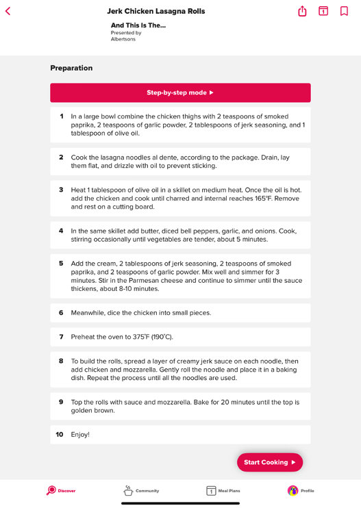

*Figure 7 : Tasty consistency with external cooking language*

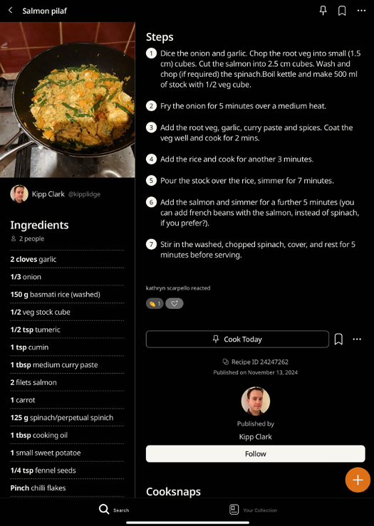

*Figure 8 : CookPad consistency with external cooking language*

## Tables with the scenario and proposal

| Scenario-Part | Finding / Description |	Garret-L / Severity | Proposal |
|-|-|-|-|
| Favouriting a recipe to cook again later (Figure 1) |	In the Tasty app, Anabella wants to save the recipe she just made, she quickly scans through the screen of the recipe and recognizes the bookmark icon which she has used before to save posts on Instagram. She knows that if she clicks this button, she will save the recipe in the app.	| Interface Design / Good	| One could use any icon that signifies saving something (Star, heart, bookmark, pin, etc.) all the aforementioned are used in different apps and work the same, users have experience with these. |
| Changing the language of the app | In the Tasty app, Anabella wants to change the language since English isn’t her first language and she feels more comfortable reading recipes in German but nowhere in the app can she find how to change the language	| Content Requirements / Serious Problem | The app should have the possibility for the users to change the language and this language change should be consistent across the whole app. This is external consistency because nowadays, users are used to being able to change the language or translate contents inside an app. |
| Icon use in app (Figure 3 & 4) | Annabella goes into the Tasty app although she has never used it before she recognizes many of the icons as common functions she has used in other apps before, while the least common icons which are on the navigation bar have text besides them to express what each means, these icons are consistent with other apps and through the app itself. This helps her get around in the app without having to put much effort from her side to guess what each thing means. | Interface Design / Good | |

## Implementation of the ideas in the app

- **Functional Consistency**: For the MealBestie, we opted to implement the star icon for favouriting a recipe. This is a common icon in design and app interaction context which is intuitive for users and contributes to the aesthetic of the app. Additionally, the favourite icon will always appear at the top of the screen when the user opens any recipe to avoid a cognitive overload or user confusion. This way the user knows where to find that function without having to look for it. The homepage navigation bar will also include a star section where users can find their saved recipes this is also a nice intuitive feature to help the users connect these two sections/functions together.

    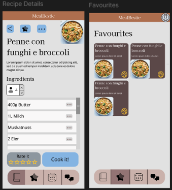

    *Figure 9 : Meal bestie funcional consistency*

- **Visual Consistency**: MealBestie’s color palette is warm pastel colors, the primary colors are soft pink and the dark yet subtle orange tone, the complementary color is light blue. This color scheme is meant to soothe the user while they use the app. We also implement adequate contrast for users with visual impairments.

    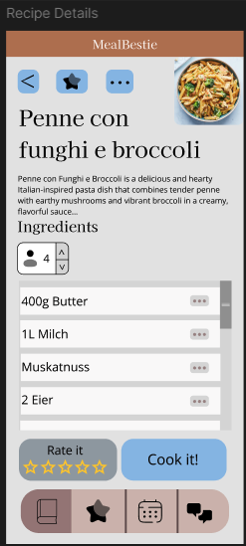

    *Figure 10 : Meal bestie visual consistency*

- **Content Consistency**: In MealBestie we want to be recognized by our friendly yet methodological demeanor as one can see on our recipe descriptions, we implement a friendly and descriptive language to express the main qualities of the meal the user is reading. Nonetheless, we keep a methodological and clear step-by-step procedure where we use more widely recognized cooking language.

    

    *Figure 11 : Meal bestie content consistency*

- **External Consistency**: As mentioned in the content consistency, this feature falls into both types of consistency. First, as the app identity, we want it to be friendly but methodological and clear when it comes to the cooking. Secondly, it meets external consistency given that we integrated real world conventions such as using cooking terms like “dice”, “sauté”, and “whisk”, terms which are familiar and universally understood by users.

    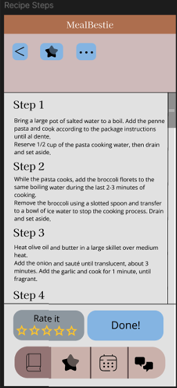

    *Figure 12 : Meal bestie external consistency*