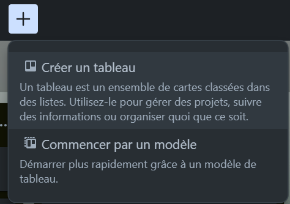
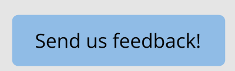
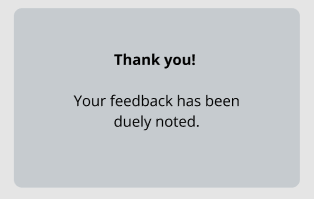
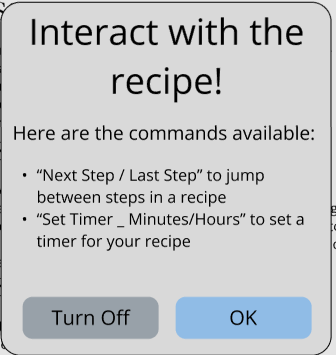

# 📝 UX Writing

- [🏠 Home](index.md)
- [💡 Learn Facts](LearnFacts/Learn%20Facts%20SW12.md)

## Scenario Persona

Annabella, a 21-year-old student juggling university and a part-time job, often uses apps to simplify her hectic schedule. She relies on clear and helpful text elements in apps to guide her efficiently through tasks like meal planning, managing finances, and organizing study schedules. With limited time and patience for lengthy instructions or vague error messages, she values text that is direct, actionable, and user-friendly.

For Annabella, microcopy like "Next Step" buttons, error messages explaining *why* something went wrong, or encouraging placeholders in search bars make all the difference. She appreciates apps that adapt their tone to the context—serious for payments, casual for social features—and always reflect empathy for the user's experience.

## Implementation in Apps

### **Trello**: Intuitive Microcopy
- Actionable buttons: "Create a Card", "Move to Board."

### **Duolingo**: Engaging and Motivational
- Onboarding instructions: "Time to make learning a habit!"
- Progress nudges: "5 minutes today keeps your streak alive."

## Tables with the scenario and proposal

| Scenario-Part | Finding / Description | Garret-L / Severity | Proposal |
|-|-|-|-|
| Send Feedback Button | The "Send us feedback!" button is clear and action-oriented, which helps Annabella understand its function immediately without confusion. This is an improvement over generic alternatives like "Submit." | Interface Design / Good | Continue using specific, action-driven labels for buttons to ensure clarity and reduce user hesitation. |
| Recipe Interaction Instructions | The message "Interact with the recipe!" provides Annabella with clear, step-by-step commands, making it easier to navigate recipe steps and timers. This reduces frustration and uncertainty. | Interface Design / Good | Maintain this level of clarity by providing explicit guidance for user interactions, ensuring users understand available actions at all times. |
| Feedback Confirmation Message | After submitting feedback, the confirmation message "Thank you! Your feedback has been duly noted." reassures Annabella that her input was received, providing closure and improving user trust. | Content Requirements / Good | Always display confirmation messages after important user actions to acknowledge their effort and build trust in the app's responsiveness. |

## Implemented in MealBestie

- Send us feedback!

- Thanking after the user put a feedback

- Interact with the recipe!

