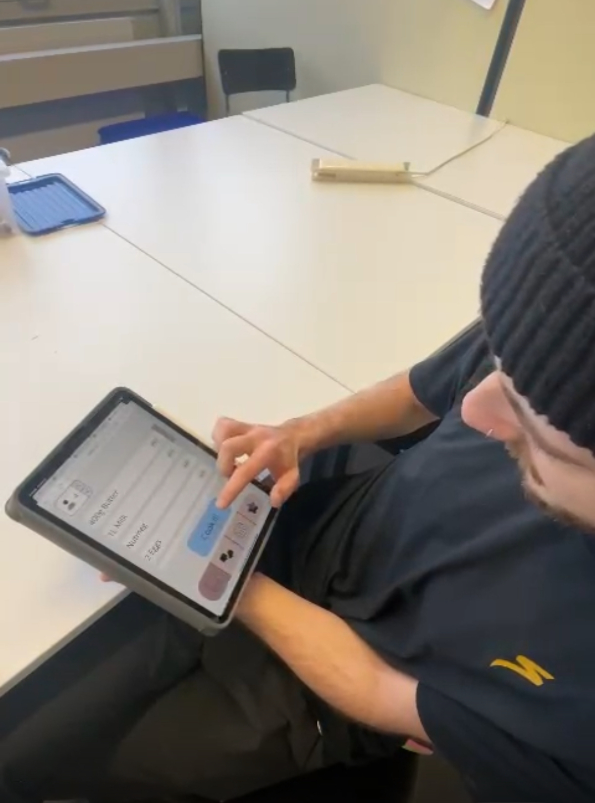
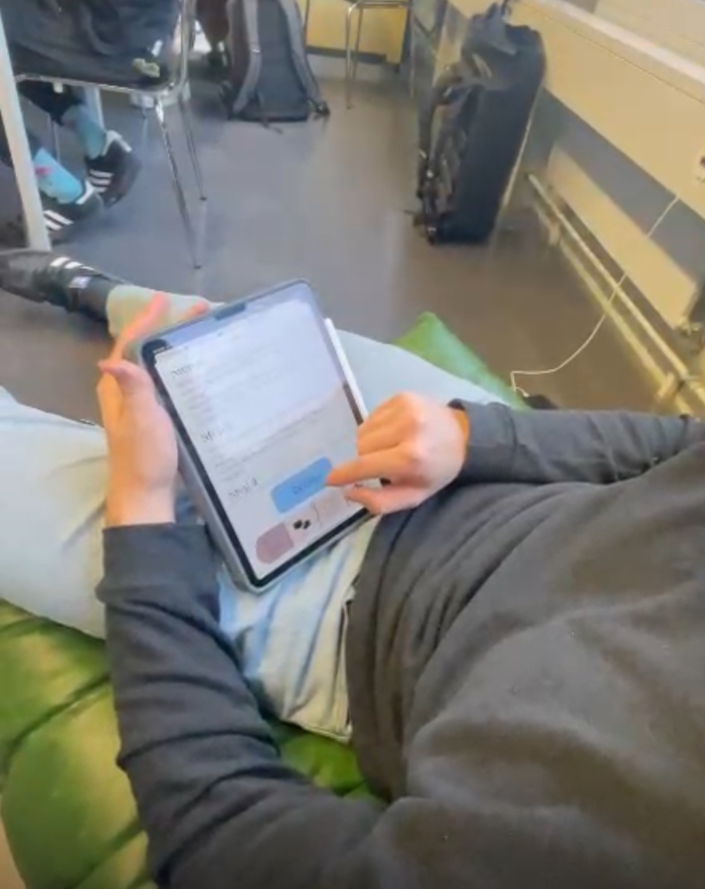

# 🧪 Usability Testing

- [🏠 Home](index.md)
- [💡 Learn Facts](LearnFacts/Learn%20Facts%20SW13.md)

## Interviews

Our usabilty expert and figma designer Ana Pretelt excecuted the usabilty test for MealBestie. She did it with three random people who have never heard about our app. This allowed us to get us a good feeling for how usable our app is. The team evaluated the tests in the [Summary of the Tests](#summary-of-the-tests) and made a [reflextion](#reflections-of-the-tests) out of the tests for further improvements

### Pre Interview instructions
- Welcome, my name is Ana Pretelt, and I am the test administrator and will be accompanying you in the coming lesson. 
- Thank you for taking the time to take the test. We appreciate it very much. 
- The test session is structured as follows: After the briefing, I will ask you a few questions about your experience with similar products. Then I will ask you to perform 1 task. Then we discuss the task together in the post-session interview. 
- Please think out loud during the task, describe what you see and what you are looking for. 
- Your comments are very valuable to us. 
- Please be open and give us your unvarnished opinion. Both good and not so good. 
- Please remember, we are testing the software, not you the user! 
- Is it ok for you that we record the session? 
- The session lasts about 6 minutes. 
- Do you have any questions before we start?

### 1st Interview with Axel Ivorra

#### Pre-session interview

| Question | Answer |
|-|-|
| What do you study? | Energy and Environmental Systems Engineering |
| Do you cook for yourself? | Yes |
| Have you ever used a cooking app to find recipes? | He searches on the internet |
| Do you have good technological knowledge in using social media, and different apps? | Yes basic knowledge with apps but not. |

#### Task

You are a working student, you come home tired and hungry, and you only have pasta and a few veggies. Find a recipe that matches what you think you have and start the preparation process on the app.

*Figure 1: Axel Ivorra is testing MealBestie*

#### Post session interview

| Question | Answer |
|-|-|
| What two to three things did you like about this system? | That you can have other ideas, with what ingredients you have |
| What two to three things would most need to be improved? | Be more specific with the steps of the recipe (how to cut the veggies), the time limits need to be clear and unrelated, instructions to prepped the veggies. |

### 2nd Interview with Leo Koch

#### Pre-session interview:

| Question | Answer |
|-|-|
| What do you study? | Mechanical Engineering |
| Do you cook for yourself? | Yes |
| Have you ever used a cooking app to find recipes? | No, only google |
| Do you have good technological knowledge in using social media, and different apps? | Yes, basic knowledge |

#### Task

You are a working student, you come home tired and hungry, and you only have pasta and a few veggies. Find a recipe that matches what you think you have and start the preparation process on the app.

*Figure 2: Leo Koch is testing MealBestie*

#### Post session interview:

| Question | Answer |
|-|-|
| What two to three things did you like about this system? | Its very colorful and my blind grandma could read this as well, design is intuitive and symbols are used universally. |
| What two to three things would most need to be improved? | I only could choose from 6 recipes and only had the ingredients for one so maybe add more recipes |

### 3rd Interview with Denis Kiener

#### Pre-session interview

| Question | Answer |
|-|-|
| What do you study? | Energy and Environmental Systems Engineering |
| Do you cook for yourself? | Yes |
| Have you ever used a cooking app to find recipes? | Yes, Paprika |
| Do you have good technological knowledge in using social media, and different apps? | Yes, basic knowledge |

#### Task

You are a working student, you come home tired and hungry, and you only have pasta and a few veggies. Find a recipe that matches what you think you have and start the preparation process on the app.

#### Post session interview

| Question | Answer |
|-|-|
| What two to three things did you like about this system? | There are pics for each meal which are helpful and easy steps and easy to read, the fact that you can favorite recipes is nice. |
| What two to three things would most need to be improved?  | A filter would be nice to search based on ingredients, list the meals, show a label on the recipes (vegan, vegetarian, normal…) or having them in separate categories, separate based on allergies. |

## Summary of the tests

| Nr | **Screen/Szenario-Part** Where did it happen? | **Findings** What did you see, find out? | **Garrett-Ebene / USAB-Thema** | **Severity** | **Interpretation** How do you interpret the finding? What is the origin of the issue? | **Massnahmenvorschlag** How can you solve this issue? Explanations without new screen-design are ok. |
|-|-|-|-|-|-|-|
| 1. | Recipe steps screen (Axel Ivorra) | Steps were not specific enough (e.g., unclear how to cut veggies, prep steps missing). | Interaction Design | High | Lack of clarity in instructions can confuse users and slow down the cooking process. | Provide detailed instructions for each step, including preparation details (e.g., how to cut veggies, estimated times for each step). |
| 2. | Recipe selection screen (Leo Koch) | Limited recipe options available (only 6 recipes). | Structure of Information | Medium | The limited recipe variety may not meet the user's specific needs, leading to dissatisfaction. | Expand the recipe database and implement a search/filter feature to match user ingredients better. |
| 3. | Recipe list and display (Denis Kiener) | No filter for ingredients, dietary preferences, or allergies; no labels for recipes. | Structure of Information | High | Users cannot easily find recipes matching dietary needs or ingredient preferences, reducing accessibility. | Add ingredient filters and labels for dietary preferences (e.g., vegan, vegetarian) and allergy information. Separate recipes into categories. |

## Reflections of the tests

Based on the usability tests, we identified key areas for improvement to enhance the user experience. The following improvements would be prioritized in future updates

1. **Detailed Recipe Instructions:**  
   Users expressed the need for more specific and clear instructions, such as how to prepare ingredients and step-by-step guidance. In future versions, we will provide detailed preparation instructions, including visuals and estimated times for each step, to ensure clarity and ease of use.

2. **Expanded Recipe Database:**  
   The limited selection of recipes hindered the app's usabilty for some users. To address this, we would implement a scroll view in figma that the user can scroll through recipes.

3. **Advanced Filtering Options:**  
   Users highlighted the absence of filters for ingredients, dietary preferences, and allergies. This feature is planned, but not yet propperly implemented in figma.

4. **Improved Recipe Categorization and Labels:**  
   Users found it difficult to identify recipes at a glance. To solve this, we would add clear labels (e.g., vegan, vegetarian, gluten-free). This will make navigation more intuitive and efficient.

5. **Consistency in Visual Design:**  
   While users appreciated the visuals, we will ensure all recipe images are of consistent quality and include step-by-step photos where applicable. This will improve the user experience