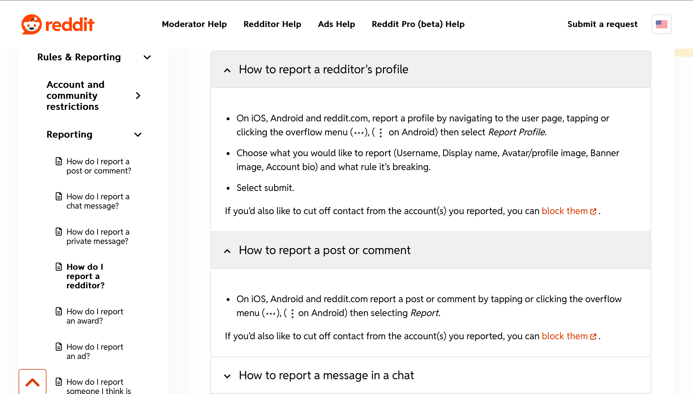

# Transfer Tasks

- [🏠 Home](../index.md)
- [💪 SW05 - Flexibility/Efficience & Feedback](../SW05%20-%20Flexibility%20Efficience%20&%20Feedback.md)

## Flexibility and Efficiency

Consider an accelerator for an advanced user of your product and build in these accelerators.

1. Shake the phone to report a problem
2. Swipe to the right to go back instead of having to click a button to go back
3. Swipe left or right to move across screens
4. Capability to automate the app with apple shortcuts/android version

## Feedback

Consider in which cases a user would wants to contact you and build a possibility for the most important case into your project.

- To report a general problem with the app → Go to settings > Help & Support
- To report someone misbehaving (User and/or post) → Go to the threads (example Reddit)

- Report recommendations if they are not suitable→ Directly on recipe page?
- If they have food poisoning → food poisoning hotline in settings and on the bottom of each recipe