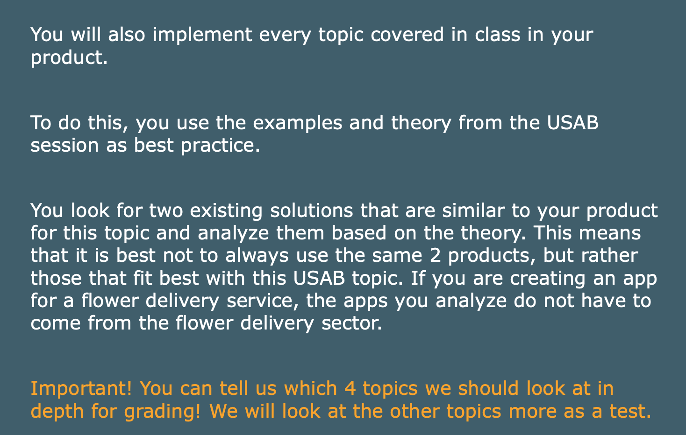
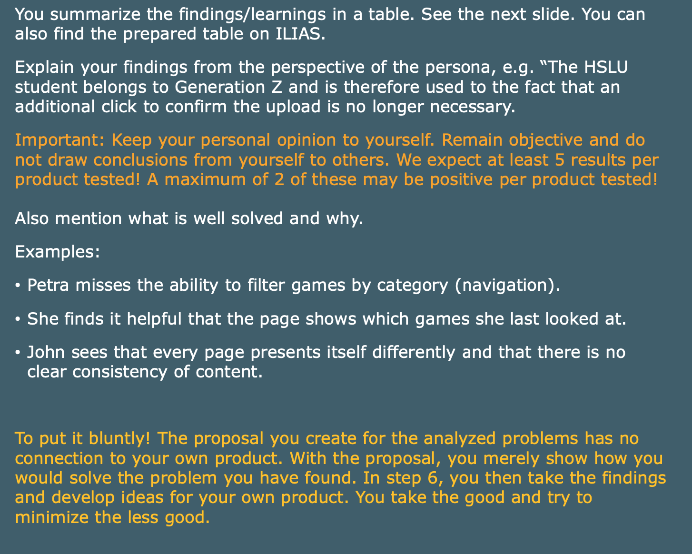
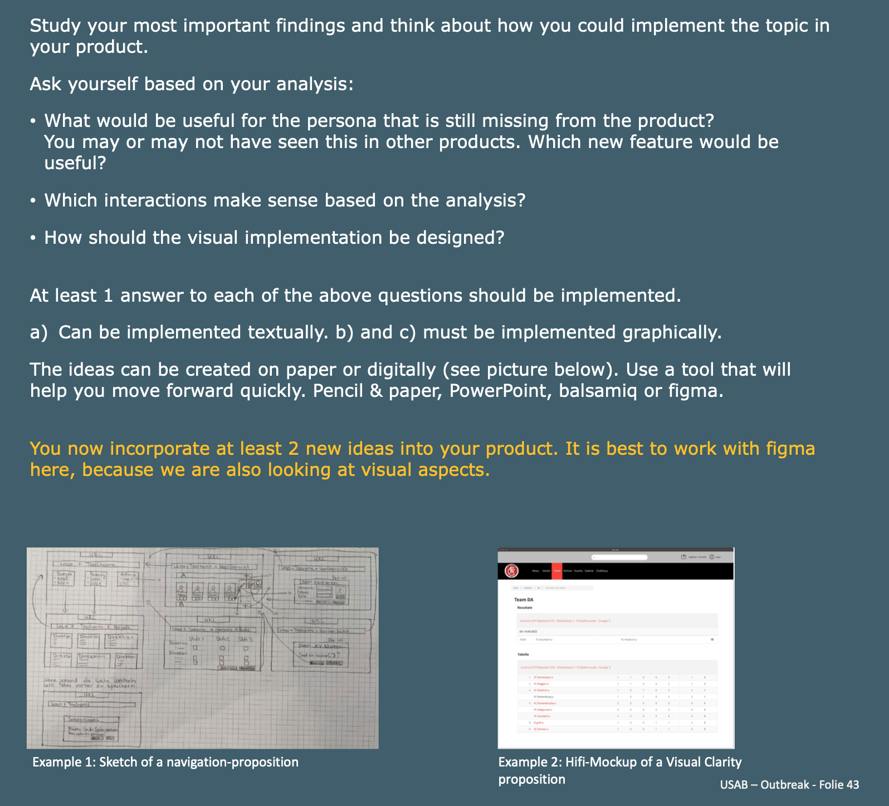
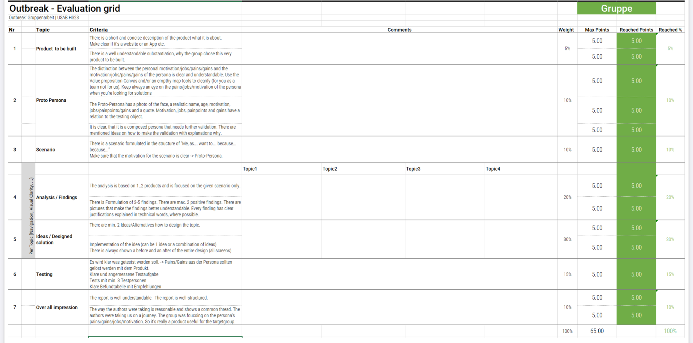
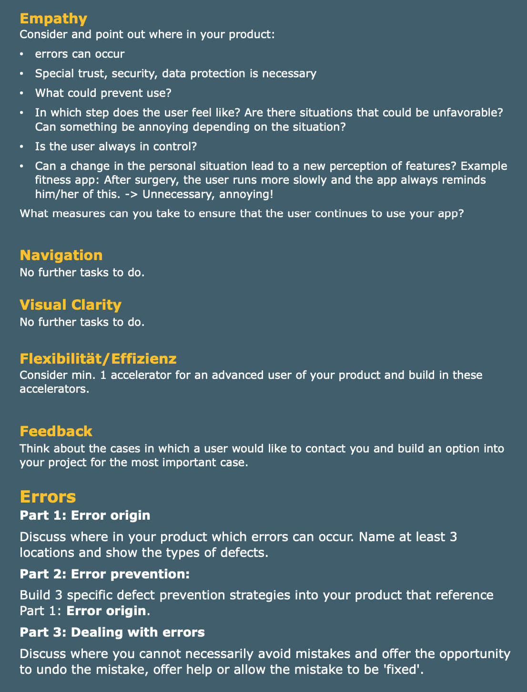
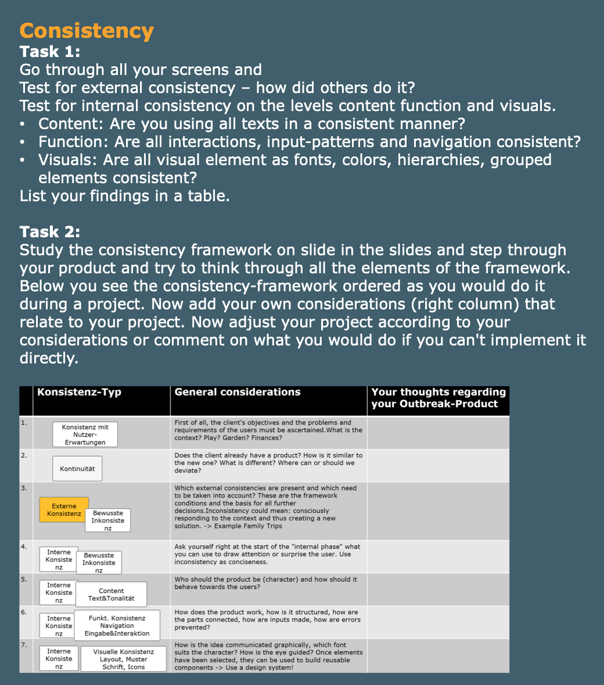
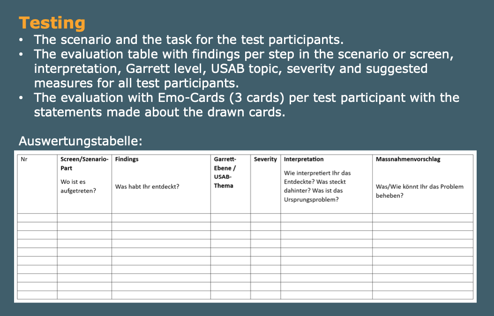

# Usability - Team 4

- [💭 SW02 - HCD-Process & Outbreak Project](SW02%20-%20HCD-Process%20&%20Outbreak%20Project.md)
- [🫶 SW03 - Empathy, Vertrautheit, Intuition](SW03%20-%20Empathy,%20Vertrautheit,%20Intuition.md) (evaluate)
- [⛵️ SW04 - Navigation](SW04%20-%20Navigation.md) (evaluate)
- [💪 SW05 - Flexibility/Efficience & Feedback](SW05%20-%20Flexibility%20Efficience%20&%20Feedback.md) (evaluate)
- [🚨 SW06 - Errors & Errors-Mgmt](SW06%20-%20Errors%20&%20Errors-Mgmt.md)
- [🔎 SW07 - Visual Clarity](SW07%20-%20Visual%20Clarity.md) (evaluate)
- [🦽 SW09 - Accessibility](SW09%20-%20Accessibility.md)
- [🕦 SW10 - Consistency](SW10%20-%20Consistency.md)
- [📝 SW12 - UX Writing](SW12%20-%20UX%20Writing.md)
- [🧪 SW13 - Usability Testing](SW13%20-%20Usability%20Testing.md)
- [🔁 Templates](Templates.md)
- [📱 Link to figma](https://www.figma.com/design/WFyYDN7eLijPJsRvvZk4Tk/MealBestie?node-id=0-1&t=5Ng1biHRU31EesTs-1)
- [🎨 Draw IO File](<Cooking App.drawio>) and [View it on google Drive](https://drive.google.com/file/d/1hFEY_kcCdUKH5Hj8J2mS8DR260-CKODJ/view?usp=sharing)
- [👨‍🏫 Notion Example From Professor](https://concise-clownfish-137.notion.site/Beispiel-Projekt-Outbreak-Fitness-Tool-10337ff349ae8109943ac8a4466ba8d0)

## TBD before submission

- [ ] resize images to propper sizes
- [ ] add captions to images

## Mep info

- We have to give four topics which we want to have meassured, the other things are attestation
- Everyone has to do writting

## Project to do

- For every topic, find two products how they do it and then integrate it into our product

- learnfacts
- Grading System

### Weekly

